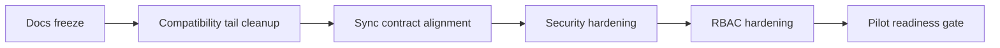

# ROADMAP

## Назначение

Этот документ описывает:

- что уже завершено;
- что обязательно закрыть до первого пилота;
- что остается после пилота;
- основные риски и меры снижения риска.

## Статусы

Используются только статусы:

- `done`
- `in_progress`
- `blocked`
- `next`
- `post_pilot`

## Что уже сделано

### Foundation

Статус: `done`

- Edge backend на Go + SQLite
- canonical SQLite first-launch path
- SQLite runtime gate
- `local_event_log`
- `pos_sync_outbox`
- retry-safe outbox foundation
- Cloud sync receiver foundation
- pairing foundation
- auth session foundation
- halls/tables foundation
- shifts foundation
- cash sessions foundation
- cash drawer events foundation
- local E2E demo bootstrap and smoke scripts

### Sales runtime

Статус: `done`

- `Order -> Precheck -> Payment -> Check` public runtime
- issue precheck
- list/get prechecks
- manager override cancel precheck
- precheck-based payments
- automatic final check
- automatic order close

### UI cashier slice

Статус: `done`

- `/pair`
- `/login`
- `/pos`
- `/lock`
- hall/table selection
- order editing
- issue/cancel precheck
- cash payment
- trusted manual card payment
- final check display

## Что обязательно закрыть до первого пилота

### Documentation freeze

Статус: `next`

Нужно:

- ввести новый `AGENTS.md`
- заменить устаревший UI spec на текущий cashier-first spec
- добавить отдельный UI RBAC document
- добавить отдельный backend API/spec document
- добавить отдельный backend data/migration policy document
- перестать документировать future modes как current runtime

### Compatibility tail cleanup

Статус: `next`

Нужно:

- удалить deprecated `/orders/{id}/check`
- перестать продвигать `device_id` как основной public field
- выбрать одно canonical имя terminal precheck state
- зафиксировать kill-plan для всех remaining transport aliases

### Sync contract alignment

Статус: `blocked`

Нельзя считать sync pilot-ready, пока не выполнено одно из двух:

- либо Cloud принимает весь фактический Edge event catalog;
- либо Edge перестает эмитить неподдерживаемые облаком события в production sender path.

Нужно:

- опубликовать canonical event catalog
- синхронизировать Cloud contract doc
- зафиксировать sender enablement gate
- описать item-level ACK plan как current target, а не implemented now

### Security hardening

Статус: `next`

Нужно:

- перевести pairing verifier на keyed format
- зафиксировать policy уникальности PIN либо employee selection login flow
- добавить/задокументировать rate limiting для PIN attempts
- проверить, что PIN и manager PIN не попадают в logs/events/storage

### RBAC hardening

Статус: `next`

Нужно:

- перейти от ad-hoc permission strings к canonical permission catalog
- описать роли cashier / senior_cashier / waiter / manager / kitchen / support_admin
- привязать UI visibility к permission model
- расширить backend enforcement beyond current manager override minimum

### Pilot scope hardening

Статус: `next`

Нужно явно решить до пилота:

- поддерживаются ли только валюты с 2 decimal places;
- вводится ли `business_date_local` как pilot blocker;
- нужен ли reprint в pilot scope;
- допускается ли waiter payment path в pilot scope;
- какие diagnostics доступны менеджеру, а какие только support/admin.

## Что можно оставить после пилота

Статус: `post_pilot`

- waiter UI runtime
- KDS runtime
- manager runtime
- settings runtime
- diagnostics runtime expansion
- PSP integration
- refund ledger flow
- print adapter layer
- inventory write-off from `DishServed`
- full Cloud projections
- advanced analytics
- multi-device / multi-client coordination beyond pilot topology

## Мильстоуны

### Pilot docs freeze

Статус: `next`

Критерий:

- весь runtime surface описан отдельными документами;
- нет устаревших основных спецификаций;
- нет противоречий между README, UI docs, backend docs и roadmap.

### Pilot API freeze

Статус: `next`

Критерий:

- deprecated alias endpoints удалены;
- transport aliases явно помечены;
- event catalog опубликован;
- compatibility tails имеют kill-plan.

### Pilot hardening freeze

Статус: `next`

Критерий:

- pairing/PIN policy закрыта;
- RBAC matrix утверждена;
- supported currency/business-date policy зафиксирована;
- print/reprint policy зафиксирована.

### Pilot readiness

Статус: `blocked`

Критерий:

- sync contract aligned
- security hardening closed
- docs freeze closed
- no unresolved critical compatibility tails

## Риски и mitigation

| Риск | Влияние | Вероятность | Mitigation |
|---|---|---|---|
| Документация обещает больше, чем реально поддерживает runtime | Высокое | Высокая | Разделить docs по владельцам и обновить их в одном PR |
| Deprecated alias останется в прод-поверхности | Среднее | Высокая | Удалить до API freeze |
| Edge/Cloud event catalog расходится | Высокое | Высокая | Ввести sender gate и canonical catalog |
| Pairing verifier остается plain hash | Высокое | Средняя | Перейти на keyed verifier до пилота |
| Duplicate PIN / ambiguous login | Высокое | Средняя | Уникальность PIN или employee-first login |
| RBAC остается неявным | Среднее | Высокая | Утвердить permission catalog и matrix |
| Пилотные assumptions по валюте и business date не зафиксированы | Высокое | Средняя | Зафиксировать policy в backend/data docs |
| Reprint нужен операционно, но не описан и не реализован | Среднее | Средняя | Либо убрать из pilot scope, либо реализовать и зафиксировать |

## Последовательность работ

## Правило stop-doing

До первого пилота нельзя тратить время на:

- legacy DB migrations для несуществующего production;
- dual-write;
- сохранение obsolete API ради “может пригодится”;
- расширение future modes без фиксации текущего cashier pilot scope.

## Definition of done для pre-pilot изменений

Изменение считается завершенным только если:

- код и тесты обновлены;
- профильная документация обновлена;
- roadmap status изменен;
- compatibility tail либо удален, либо получил owner + kill-plan;
- изменение не создало новый historical хвост.
