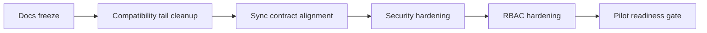

# ROADMAP

## Назначение

Этот документ описывает:

- что уже завершено;
- что обязательно закрыть до первого пилота;
- что остается после пилота;
- основные риски и меры снижения риска.

## Статусы

Используются только статусы:

- `done`
- `in_progress`
- `blocked`
- `next`
- `post_pilot`

## Что уже сделано

### Foundation

Статус: `done`

- Edge backend на Go + SQLite
- canonical SQLite first-launch path
- SQLite runtime gate
- `local_event_log`
- `pos_sync_outbox`
- retry-safe outbox foundation
- explicit directional sync ownership foundation
- Cloud -> Edge master sync metadata/checkpoint schema foundation
- Cloud sync receiver foundation
- pairing foundation
- auth session foundation
- halls/tables foundation
- personal employee shifts foundation
- cash shifts foundation (`cash_sessions`)
- cash drawer events foundation
- local E2E demo bootstrap и smoke scripts

### Sales runtime

Статус: `done`

- публичный runtime `Order -> Precheck -> Payment -> Check`
- issue precheck
- list/get prechecks
- manager override cancel precheck
- precheck-based payments
- automatic final check
- automatic order close

### UI cashier slice

Статус: `done`

- `/pair`
- `/login`
- `/pos`
- `/lock`
- hall/table selection
- order editing
- issue/cancel precheck
- cash payment
- trusted manual card payment
- final check display
- личная смена сотрудника обязательна для POS runtime; кассовая смена обязательна только для оплат и cash drawer операций

## Что обязательно закрыть до первого пилота

### Documentation freeze

Статус: `next`

Нужно:

- ввести новый `AGENTS.md`
- заменить устаревший UI spec на текущий cashier-first spec
- добавить отдельный UI RBAC document
- добавить отдельный backend API/spec document
- добавить отдельный backend data/migration policy document
- перестать документировать future modes как current runtime

### Очистка compatibility-хвостов

Статус: `done`

Сделано:

- удалены public compatibility endpoints старой check/payment модели;
- `device_id` больше не описывается как transport compatibility alias; он остается domain/storage field для POS Edge node identity в operational payload;
- canonical transport examples используют `node_device_id` и `client_device_id`.

### Выравнивание sync contract

Статус: `done`

Сделано:

- Cloud принимает фактический Edge -> Cloud operational event catalog;
- production sender path имеет direction gate и не отправляет Cloud-managed/configuration события вверх;
- `pos_sync_outbox.sync_direction` явно разделяет `edge_to_cloud`, `cloud_to_edge` и `local_only`;
- Edge runtime mutation Cloud-owned master data запрещен application boundary;
- ownership matrix добавлена в `docs/sync/directional-sync-ownership.md`;
- canonical Edge/Cloud sync contract обновлен в `docs/sync/edge-cloud-contracts-v1.md`;
- POS sender включен как отдельный background worker с retry/backoff, stale lock reclaim и idempotent resend;
- Cloud хранит raw envelopes и append-safe operational event journal.

planned next:

- item-level ACK plan;
- richer Cloud projections поверх `cloud_operational_events`;
- production Cloud -> Edge provisioning/import endpoints для master/reference/configuration данных.

### Security hardening

Статус: `done`

implemented now:

- pairing verifier хранится в keyed format `pairing.hmac-sha256.v1`;
- PIN login policy: PIN должен однозначно определить одного active employee в ресторане; дубль active PIN отклоняется как conflict.
- PIN login rate limiting добавлен и задокументирован;
- тесты проверяют, что PIN, manager PIN и PIN hash не попадают в HTTP audit logs, local events, outbox payloads и manager override audit.

### RBAC hardening

Статус: `in_progress`

Нужно:

- завершить перевод remaining ad-hoc permission checks к canonical permission catalog
- описать роли cashier / senior_cashier / waiter / manager / kitchen / support_admin
- привязать UI visibility к permission model
- расширить backend enforcement beyond current manager override minimum

implemented now:

- canonical backend permission catalog introduced for cashier runtime hardening;
- app-layer permission enforcement added for personal-shift/cash-shift/order/precheck-issue/payment operations;
- app-layer permission enforcement added for cash drawer event recording;
- operator-triggered `sync/retry-failed` is enforced via backend permission `pos.sync.retry_failed`.
- app-layer permission enforcement added for read/runtime APIs: personal shift current/recent, current cash session, order/precheck/check read flows, sync status/outbox read flows;
- precheck cancel override flow now enforces split actor/approver permissions (`pos.precheck.cancel.request` + `pos.precheck.cancel`).
- app-layer permission enforcement added for floor/menu runtime reads and `GET /api/v1/sync/local-events`.
- role creation/import now rejects unknown permission ids outside canonical backend catalog.
- UI visibility in cashier flow is now wired to backend permission model (UX-only gate, backend remains final enforcement).

planned next:

- complete enforcement coverage for the entire UI RBAC matrix and override variants.
### Pilot scope hardening

Статус: `in_progress`

Нужно явно решить до пилота:

- вводится ли `business_date_local` как pilot blocker;
- нужен ли reprint в pilot scope;
- допускается ли waiter payment path в pilot scope;
- какие diagnostics доступны менеджеру, а какие только support/admin.

implemented now:

- currency policy больше не ограничена локальным subset: pilot runtime использует полный active ISO 4217 catalog (включая валюты ЮВА) с precision по коду валюты (`0/2/3/4`);
- Cloud PostgreSQL получил canonical ISO 4217 currency template (`cloud_currency_reference`);
- Cloud provisioning contract поддерживает `currencies` stream для Cloud -> Edge master/reference payload.
- startup migration policy закрепляет `db_runtime_versions` + backup-before-upgrade для `SQLite` и `PostgreSQL`.

## Что можно оставить после пилота

Статус: `post_pilot`

- waiter UI runtime
- KDS runtime
- manager runtime
- settings runtime
- diagnostics runtime expansion
- PSP integration
- refund ledger flow
- print adapter layer
- inventory write-off from `DishServed`
- full Cloud projections
- advanced analytics
- multi-device / multi-client coordination beyond pilot topology

## Мильстоуны

### Pilot docs freeze

Статус: `next`

Критерий:

- весь runtime surface описан отдельными документами;
- нет устаревших основных спецификаций;
- нет противоречий между README, UI docs, backend docs и roadmap.

### Pilot API freeze

Статус: `next`

Критерий:

- compatibility endpoints удалены;
- event catalog опубликован;
- first-launch API не содержит unresolved public compatibility tails.

### Pilot hardening freeze

Статус: `next`

Критерий:

- pairing/PIN policy закрыта;
- RBAC matrix утверждена;
- supported currency/business-date policy зафиксирована;
- print/reprint policy зафиксирована.

### Pilot readiness

Статус: `blocked`

Критерий:

- sync contract aligned;
- security hardening closed;
- docs freeze closed;
- no unresolved critical compatibility tails.

## Риски и mitigation

| Риск | Влияние | Вероятность | Митигирующее действие |
|---|---|---|---|
| Документация обещает больше, чем реально поддерживает runtime | Высокое | Высокая | Разделить docs по владельцам и обновлять их в одном PR |
| Старый compatibility endpoint вернется в public surface | Среднее | Средняя | Проверять `rg` по API routes/docs перед freeze |
| Edge/Cloud event catalog снова расходится | Высокое | Средняя | Поддерживать canonical catalog в `docs/sync/edge-cloud-contracts-v1.md` и тестировать sender direction gate |
| Pairing verifier остается plain hash | Высокое | Средняя | Перейти на keyed verifier до пилота |
| Duplicate PIN / ambiguous login | Высокое | Средняя | Ввести уникальность PIN или employee-first login |
| RBAC остается неявным | Среднее | Высокая | Утвердить permission catalog и matrix |
| Пилотные assumptions по валюте и business date не зафиксированы | Высокое | Средняя | Зафиксировать policy в backend/data docs |
| Reprint нужен операционно, но не описан и не реализован | Среднее | Средняя | Либо убрать из pilot scope, либо реализовать и зафиксировать |

## Последовательность работ

## Правило stop-doing

До первого пилота нельзя тратить время на:

- historical DB migrations для несуществующего production;
- dual-write;
- сохранение obsolete API ради “может пригодится”;
- расширение future modes без фиксации текущего cashier pilot scope.

## Критерии готовности pre-pilot изменений

Изменение считается завершенным только если:

- код и тесты обновлены;
- профильная документация обновлена;
- roadmap status изменен;
- compatibility tail удален из public surface;
- изменение не создало новый historical хвост.

### Logging hardening

Статус: `done`

Сделано:

- введен единый structured logging contract для backend операций;
- добавлены уровни `TRACE/DEBUG/INFO/WARN/ERROR` с runtime env-конфигом;
- добавлены правила masking/redaction чувствительных auth-данных.

### Worker telemetry unification

Статус: `done`

Сделано:

- добавлен shared helper для non-HTTP telemetry нормализации (`operation/action/result/error_code`);
- sync sender покрыт TRACE lifecycle событиями;
- временный локальный каталог `test_pipe/` очищен как unmanaged artifact.

### Sync contract hardening update (2026-05-07)

Статус: `done`

Сделано:
- item-level ACK batch flow реализован (`POST /api/v1/sync/edge-events/batch` + batch sender mapping на Edge).
- richer Cloud projections поверх `cloud_operational_events` реализованы (`cloud_projection_event_type_stats`, `cloud_projection_shift_finance`).
- production Cloud -> Edge provisioning/import package endpoints реализованы (`PUT/GET /api/v1/provisioning/master-data/{stream}`).

Статус следующих шагов: `next`
- авторизация production perimeter для provisioning endpoints;
- projection query endpoints для ops dashboards.
