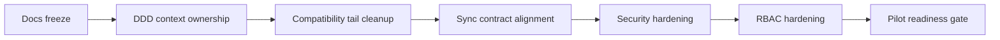

# ROADMAP

## Назначение

Этот документ описывает:

- что уже завершено;
- что обязательно закрыть до первого пилота;
- что остается после пилота;
- основные риски и меры снижения риска.

## Статусы

Используются только русские статусы:

- `выполнено`
- `в работе`
- `заблокировано`
- `далее`
- `после пилота`

## Что уже сделано

### Foundation

Статус: `выполнено`

- Edge backend на Go + SQLite.
- Canonical SQLite first-launch/startup path через ordered managed SQL files `001_init.sql` + `002_runtime_schema_repair.sql`.
- SQLite runtime gate.
- `local_event_log`.
- `pos_sync_outbox`.
- Retry-safe outbox foundation.
- Explicit directional sync ownership foundation.
- Cloud -> Edge master sync metadata/checkpoint schema foundation.
- Cloud sync receiver foundation.
- Pairing foundation.
- Auth session foundation.
- Halls/tables foundation.
- Personal employee shifts foundation.
- Cash sessions foundation (`cash_sessions`).
- Cash drawer events foundation.
- Local E2E demo bootstrap и smoke scripts.

### Sales runtime

Статус: `выполнено`

- Публичный runtime `Order -> Precheck -> Payment -> Check`.
- Issue precheck.
- List/get prechecks.
- Manager override cancel precheck.
- Precheck-based payments.
- Partial payments.
- Automatic final check.
- Automatic order close.

### UI cashier slice

Статус: `выполнено`

- `/pair`.
- `/login`.
- `/pos`.
- `/lock`.
- Hall/table selection.
- Order editing.
- Issue/cancel precheck.
- Cash payment.
- Trusted manual card payment.
- Final check display.
- Личная смена сотрудника обязательна для POS runtime; кассовая смена обязательна только для оплат и cash drawer операций.

### Sync contract hardening

Статус: `выполнено`

- Cloud принимает фактический Edge -> Cloud operational event catalog.
- Production sender path имеет direction gate и не отправляет Cloud-managed/configuration события вверх.
- `pos_sync_outbox.sync_direction` явно разделяет `edge_to_cloud`, `cloud_to_edge` и `local_only`.
- Edge runtime mutation Cloud-owned master data запрещен application boundary.
- Ownership matrix добавлена в `docs/sync/directional-sync-ownership.md`.
- Canonical Edge/Cloud sync contract обновлен в `docs/sync/edge-cloud-contracts-v1.md`.
- POS sender включен как отдельный background worker с retry/backoff, stale lock reclaim и idempotent resend.
- Cloud хранит raw envelopes и append-safe operational event journal.
- Item-level ACK batch flow реализован через `POST /api/v1/sync/edge-events/batch` и batch sender mapping на Edge.
- Cloud projections поверх `cloud_operational_events` реализованы для event type stats и shift finance foundation.
- Production Cloud -> Edge provisioning/import package endpoints реализованы через `PUT/GET /api/v1/provisioning/master-data/{stream}`.

### Security hardening

Статус: `выполнено`

- Pairing verifier хранится в keyed format `pairing.hmac-sha256.v1`.
- PIN login policy: PIN должен однозначно определить одного active employee в ресторане; дубль active PIN отклоняется как conflict.
- PIN login rate limiting добавлен и задокументирован.
- Тесты проверяют, что PIN, manager PIN и PIN hash не попадают в HTTP audit logs, local events, outbox payloads и manager override audit.

### RBAC hardening

Статус: `выполнено`

- Canonical backend permission catalog покрывает реализованный pilot runtime surface.
- Role profiles зафиксированы в коде для `cashier`, `senior_cashier`, `waiter`, `manager`, `kitchen`, `support_admin`.
- App-layer permission enforcement покрывает personal shifts, cash sessions, cash drawer events, catalog/floor/menu reads, order/precheck/payment/check runtime и operator-triggered sync APIs.
- Payment permissions разделены по method: `pos.payment.cash`, `pos.payment.card.manual`, `pos.payment.other`.
- Precheck cancel override проверяет split actor/approver permissions: `pos.precheck.cancel.request` + `pos.precheck.cancel`.
- Role creation/import отклоняет неизвестные permission IDs вне canonical backend catalog.
- UI visibility в cashier flow привязан к backend permission IDs и не делает protected read calls без нужных permissions.
- Нереализованные строки матрицы явно отмечены как `вне текущего объема` в `docs/ui/POS-UI-RBAC.md`.

### Pilot scope hardening

Статус: `выполнено`

- `business_date_local` введен как backend-owned policy для режимов `standard` и `24_7`.
- `business_date_local` сохраняется в `checks`, `payments`, `shifts` и `cash_sessions`.
- Controlled reprint включен в pilot scope и строится из immutable snapshots для precheck и final check.
- Reprint audit пишется через `local_event_log` и Edge -> Cloud события `PrecheckReprinted` / `CheckReprinted`.
- Waiter payment остается после MVP: waiter не получает `pos.payment.*`, личные кассы официантов не создаются.
- Currency policy больше не ограничена локальным subset: pilot runtime использует полный active ISO 4217 catalog, включая валюты ЮВА, с precision по коду валюты.
- Cloud PostgreSQL получил canonical ISO 4217 currency template (`cloud_currency_reference`).
- Cloud provisioning contract поддерживает `currencies` stream для Cloud -> Edge master/reference payload.
- Startup migration policy закрепляет `db_runtime_versions`, managed SQL files per module, `schema_migrations` с checksum, backup-before-upgrade/data-upgrade, schema verification и fail-fast при downgrade для `SQLite` и `PostgreSQL`.
- POS SQLite startup path довыравнивает старые pre-pilot БД через `002_runtime_schema_repair.sql`, чтобы implemented-now runtime columns не ловились по одной на schema verification.

## Что обязательно закрыть до первого пилота

### Фиксация владения DDD-контекстов

Статус: `в работе`

Задачи:

- создать `docs/architecture/DDD-CONTEXT-MAP.md`;
- перенести architecture/business content out of `AGENTS.md` в профильные документы;
- согласовать `SPECv1.3.md`, `ROADMAP.md` и `docs/backend/POS-DATA-AND-MIGRATIONS.md`;
- явно зафиксировать scope повторной печати;
- зафиксировать `business_date_local` как закрытый backend-owned инвариант, а не pilot blocker;
- явно решить минимальную модель `Pricing` перед MVP;
- явно решить минимум `Catalog` modifiers/POS category перед MVP;
- явно решить, остается ли `Inventory` foundation schema-only или получает app services перед MVP.

### Documentation freeze

Статус: `далее`

Нужно:

- убедиться, что `AGENTS.md` остается tooling guide, а не архитектурной спецификацией;
- проверить, что cashier-first UI spec, backend spec, data/migration policy, sync docs и DDD context map согласованы;
- перестать документировать будущие modes как current runtime;
- убрать англоязычные человекочитаемые статусы из русской документации, кроме машинно-читаемых значений.

### Pilot API freeze

Статус: `далее`

Критерий:

- compatibility endpoints удалены;
- event catalog опубликован;
- first-launch API не содержит unresolved public compatibility tails.

### Pilot hardening freeze

Статус: `далее`

Критерий:

- pairing/PIN policy закрыта;
- RBAC matrix утверждена;
- supported currency/business-date policy зафиксирована;
- print/reprint policy зафиксирована;
- backup-before-data-load policy реализована для Cloud -> Edge full snapshot/master-data import;
- административная UI-операция очистки/пересоздания SQLite реализована с backup, явным подтверждением, RBAC/audit и rebootstrap/restart path;
- минимальная граница `Pricing` / `Catalog` зафиксирована.

### Pilot readiness

Статус: `заблокировано`

Критерий снятия блокировки:

- sync contract aligned;
- security hardening closed;
- docs freeze closed;
- нет unresolved critical compatibility tails;
- решены pilot blockers по `Pricing`, `Catalog` minimum и inventory scope.

## Что можно оставить после пилота

Статус: `после пилота`

- Waiter UI runtime.
- KDS runtime.
- Manager runtime.
- Settings runtime.
- Diagnostics runtime expansion.
- Full CRM.
- Full Loyalty.
- Full Delivery/Aggregator.
- Full Procurement.
- Full Reservation.
- Real PSP.
- Real Fiscalization.
- Advanced Accounting.
- Complex Inventory costing.
- Refund ledger flow.
- Print adapter layer.
- Inventory write-off from `DishServed`, если пилот не требует этого раньше.
- Full Cloud projections.
- Advanced analytics.
- Multi-device / multi-client coordination beyond pilot topology.

## Риски и mitigation

| Риск | Влияние | Вероятность | Митигирующее действие |
| --- | --- | --- | --- |
| Документация обещает больше, чем реально поддерживает runtime | Высокое | Высокая | Разделить docs по владельцам и обновлять их в одном PR |
| Старый compatibility endpoint вернется в public surface | Среднее | Средняя | Проверять `rg` по API routes/docs перед freeze |
| Edge/Cloud event catalog снова расходится | Высокое | Средняя | Поддерживать canonical catalog в `docs/sync/edge-cloud-contracts-v1.md` и тестировать sender direction gate |
| Duplicate PIN / ambiguous login | Высокое | Средняя | Сохранять текущую policy rejection или перейти к employee-first login |
| Future/runtime permission matrix может снова разойтись при добавлении новых экранов | Среднее | Средняя | Не добавлять runtime operation без canonical permission ID, backend enforcement, UI visibility и тестов |
| Pilot assumptions по `Pricing` не зафиксированы как отдельное владение | Среднее | Средняя | Принять минимальную модель цены до API freeze |
| Inventory foundation может быть ошибочно прочитан как готовый складской runtime | Среднее | Средняя | Явно держать schema/domain foundation отдельно от app services до отдельного решения |

## Последовательность работ

## Правило stop-doing

До первого пилота нельзя тратить время на:

- manual/ad-hoc DB migrations для несуществующего production вместо программного startup-upgrade path;
- dual-write;
- сохранение obsolete API ради “может пригодится”;
- расширение будущих modes без фиксации текущего cashier pilot scope;
- большой package refactor только ради целевой DDD-карты.

## Критерии готовности pre-pilot изменений

Изменение считается завершенным только если:

- код и тесты обновлены, если менялся runtime;
- профильная документация обновлена;
- roadmap status изменен;
- compatibility tail удален из public surface или получил владельца, причину, срок удаления, тест и запись в спецификации;
- изменение не создало новый historical хвост.

### Logging hardening

Status: `implemented now`

- Введен единый structured logging contract для backend операций.
- Добавлены уровни `TRACE/DEBUG/INFO/WARN/ERROR` с runtime env-конфигом.
- Добавлены правила masking/redaction чувствительных auth-данных.

### Error handling hardening

Статус: `выполнено`

- POS backend возвращает безопасный stable error envelope: `code`, `message_key`, `correlation_id`.
- Panic/unexpected errors превращаются в safe `500 INTERNAL_ERROR`, details остаются в backend logs.
- POS UI нормализует backend/network errors в `ApiError`, показывает blocking business errors через modal dialog и использует `vue-i18n`.
- TanStack mutations не имеют опасного auto-retry для write/financial commands.
- Каталог ошибок зафиксирован в `docs/backend/POS-ERROR-CATALOG.md`.

### Worker telemetry unification

Статус: `выполнено`

- Добавлен shared helper для non-HTTP telemetry normalization: `operation`, `action`, `result`, `error_code`.
- Sync sender покрыт TRACE lifecycle events.
- Временный локальный каталог `test_pipe/` очищен как unmanaged artifact.

### SQLite maintenance hardening

Статус: `выполнено`

- Добавлен explicit maintenance helper для `VACUUM`, `VACUUM INTO`, `PRAGMA optimize`, `PRAGMA wal_checkpoint(TRUNCATE)`.
- `VACUUM` / `VACUUM INTO` требуют явный `-force` / `-Force`.
- Documented policy запрещает автоматический `VACUUM` на каждом startup и запуск внутри active write transaction.

### Sync contract hardening update 2026-05-07

Статус: `выполнено`

- Item-level ACK batch flow реализован: `POST /api/v1/sync/edge-events/batch` + batch sender mapping на Edge.
- Cloud projections поверх `cloud_operational_events` реализованы: `cloud_projection_event_type_stats`, `cloud_projection_shift_finance`.
- Cloud PostgreSQL startup path довыравнивает implemented-now projection/runtime tables через ordered managed migrations; `002_projection_event_type_stats.sql` создает `cloud_projection_event_type_stats`, `003_runtime_schema_repair.sql` ремонтирует весь required runtime schema set для старых БД.
- planned next query endpoints не блокируют startup verification.
- Production Cloud -> Edge provisioning/import package endpoints реализованы: `PUT/GET /api/v1/provisioning/master-data/{stream}`.

Status next steps: `planned next`

- Авторизация production perimeter для provisioning endpoints.
- Projection query endpoints для ops dashboards.

### Database Access & Reporting Architecture update 2026-05-08

- [ ] Создать `docs/adr/ADR-012-persistence-and-analytics-strategy.md`
- [ ] Зафиксировать sqlc как основной persistence-подход для SQLite/PostgreSQL
- [ ] Зафиксировать ClickHouse как облачный OLAP/reporting accelerator
- [ ] Добавить PostgreSQL → ClickHouse projection pipeline в будущие этапы
- [ ] Запретить GORM/Ent в POS Core financial/offline/sync-critical flows
