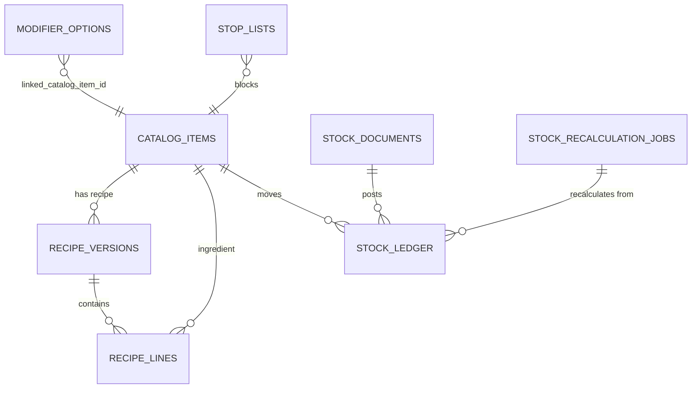

# Inventory And Costing Spec

Статус: целевая архитектура полного Cloud-owned складского движка, stop-list, costing и ClickHouse OLAP для полного пилота; schema/worker foundation частично реализован сейчас, runtime gaps отмечены ниже.

Этот документ является source of truth для дальнейшей реализации склада, stop-list, рецептурного списания и себестоимости. Он заменяет прежнюю идею, где POS Edge сам создавал `StockDocument`, `StockMove` и считал остатки.

## Замороженные Принципы

- POS Edge и KDS являются генераторами неизменяемых business events и интерфейсом ввода данных.
- POS Edge не создает складские документы, складские проводки и не считает себестоимость.
- Cloud является единственным источником истины для склада, себестоимости, пересчета и аналитического журнала движений.
- Остаток склада является аналитическим показателем, допускает отрицательные значения и не блокирует продажу.
- Продажу блокирует только `StopList`, синхронизируемый в обе стороны.
- ClickHouse используется как immutable event archive и OLAP слой для аналитики, не как transactional source of truth.

## Architecture And Data Flow

Целевой поток:

```text
POS Edge / KDS
  -> Edge outbox business events
  -> Cloud API (PostgreSQL inbox_events)
     -> Async Batch Forwarder -> ClickHouse raw_business_events
     -> Inventory Worker -> PostgreSQL stock_ledger / stock_documents / costing state
     -> ClickHouse olap_stock_moves
```

POS Edge сохраняет cashier/KDS факты локально и отправляет события через outbox. Cloud API принимает события идемпотентно, пишет их в PostgreSQL `inbox_events` и не выполняет synchronous dual-write в ClickHouse. Async Batch Forwarder экспортирует события в ClickHouse `raw_business_events`. Inventory Worker асинхронно обрабатывает accepted events, разворачивает рецепты, применяет stop-list side effects, создает Cloud-owned складские документы и пишет хронологический `stock_ledger`.

PostgreSQL хранит транзакционный журнал и состояния пересчета. Реализовано сейчас: ClickHouse хранит immutable `raw_business_events` бессрочно и получает первый bounded slice `olap_stock_moves` из PostgreSQL `stock_ledger` для чтения складских движений. COGS, маржинальность, остатки и агрегированная кухонная аналитика остаются `запланировано далее`, пока нет полного costing/recalculation engine и агрегированных projection данных.

## Pilot Implementation Boundary

Реализовано сейчас:

- Cloud PostgreSQL baseline содержит `inventory_event_queue`, `stock_documents`, `stock_ledger`, `stock_recalculation_jobs` и `stop_lists`.
- Cloud Inventory Worker умеет принимать нормализованные item payloads по inventory-relevant events и писать pilot ledger rows.
- Cloud Inventory Worker дедуплицирует `ItemServed` replay и последующий `CheckClosed` по `order_line_id`: `CheckClosed` пишет только положительную unserved delta, replay одного `CheckClosed` не создает второй stock document, superseded `ItemServed` пропускается, если superseding served fact уже принят Cloud до обработки очереди.
- POS Edge SQLite baseline содержит `recipe_versions`, `recipe_lines`, `stop_lists` и `warehouse_reference`; текущий runtime использует их для local sale blocking и kitchen stock input validation, но не для stock consumption/costing.
- Cloud -> Edge generic package contracts принимают `recipes` и `inventory_reference`; POS Edge ingest применяет `recipe_versions`, `recipe_lines`, `stop_lists` и `warehouse_reference`.
- POS Edge генерирует `CheckClosed` при создании final check после полной оплаты; payload строится из immutable `check.Snapshot`.
- POS Edge kitchen stock input routes генерируют `StockReceiptCaptured`, `InventoryCountCaptured`, `StockWriteOffCaptured` и `ProductionCompleted` в local event/outbox без создания POS-side stock documents/ledger.
- POS Edge replay того же kitchen stock `command_id` для того же event type возвращает сохраненный результат из outbox и не создает повторный local/outbox event.

Запланировано до полного пилота:

- Edge-origin stop-list edit sync/conflict policy для `inventory_reference`;
- компенсирующий пересчет, если первый `ItemServed` уже обработан складским Worker до прихода последующего `served -> recall -> ... -> serve`;
- stop-list edit events from KDS/POS Edge;
- full inventory engine: stock receipts, inventory counts, production, sale consumption, refund/cancellation dispositions, recipe expansion, modifier linked catalog item consumption, stock balances, costing status и retro recalculation DAG;
- ClickHouse `olap_stock_moves` реализован как первый bounded read; retry/backfill controls и агрегированные read-only OLAP API остаются `запланировано далее`;
- smoke-проверка balances/costing и fault-injection reconnect/outbox ACK.

Вне текущего объема полного пилота:

- procurement planning и transfer workflows;
- hardware bump-bar integrations, kitchen printer orchestration and rich BI dashboards beyond bounded pilot OLAP/KDS metrics.

## POS Edge SQLite Target Schema

Реализовано сейчас:

- POS Edge SQLite целевая схема не содержит `stock_documents`, `stock_moves`, `stock_balances`, `item_costs`, `purchase_receipts`, `purchase_receipt_lines`; прежний Edge-side manual stock document method использовался в pre-pilot foundation и удален.
- Оставить `recipe_versions` и `recipe_lines` как read-only reference tables, которыми владеет Cloud.
- `stop_lists` присутствует как локальный overlay; двусторонняя синхронизация остается следующим шагом.

Целевые Edge таблицы для склада:

```text
recipe_versions
recipe_lines
stop_lists
```

`recipe_versions` и `recipe_lines` нужны Edge только для KDS UI и локальной проверки stop-list. Они не дают Edge права создавать stock moves.

`stop_lists`:

| Column | Type | Правило |
| --- | --- | --- |
| `id` | UUID v7 | стабильный id записи |
| `restaurant_id` | UUID v7 | ресторан |
| `catalog_item_id` | UUID v7 | блюдо, товар или заготовка |
| `available_quantity` | DECIMAL nullable | `0` блокирует продажу; `null` означает флаговый stop без счетчика |
| `source` | TEXT | `edge`, `cloud`, `sync` |
| `reason` | TEXT nullable | безопасный операторский reason |
| `active` | BOOLEAN | активность overlay |
| `cloud_version` | INTEGER nullable | версия Cloud package |
| `updated_at` | TIMESTAMP | время изменения |

## Cloud PostgreSQL Target Schema

Cloud PostgreSQL владеет transactional inventory model:

- `stock_documents` - Cloud-owned документы типов `SALE`, `RETURN`, `WASTE`, `PRODUCTION`, `PURCHASE`, `ADJUSTMENT`, `TRANSFER`, `INVENTORY_COUNT`.
- `stock_ledger` - immutable хронологический журнал проводок с unit cost.
- `stock_recalculation_jobs` - очередь ретроспективного пересчета.
- `stop_lists` - authoritative stop-list state с двусторонней синхронизацией.
- `olap_stock_moves` - ClickHouse проекция, не PostgreSQL source table.

Минимальная структура `stock_ledger`:

| Column | Type | Правило |
| --- | --- | --- |
| `id` | UUID v7 | id проводки |
| `restaurant_id` | UUID v7 | tenant boundary |
| `stock_document_id` | UUID v7 | Cloud-owned документ |
| `source_event_id` | UUID v7 | исходное Edge/Cloud событие |
| `source_event_type` | TEXT | например `CheckClosed`, `ItemServed`, `ProductionCompleted` |
| `catalog_item_id` | UUID v7 | товар, ингредиент, заготовка или блюдо |
| `order_line_id` | UUID v7 nullable | связь с позицией заказа |
| `movement_type` | TEXT | `IN` или `OUT` |
| `quantity` | DECIMAL | signed quantity в базовой единице |
| `unit_code` | TEXT | machine code единицы |
| `unit_cost_minor` | INTEGER | себестоимость единицы на момент события |
| `total_cost_minor` | INTEGER | `quantity * unit_cost_minor` с правилами округления |
| `costing_status` | TEXT | `final`, `estimated`, `needs_recalculation`, `recalculated`, `failed` |
| `occurred_at` | TIMESTAMP | business event time |
| `business_date_local` | DATE | дата ресторана |
| `created_at` | TIMESTAMP | запись в Cloud |

ER target:



## Stop-List Logic

`StopList` блокирует продажу независимо от аналитического stock balance. Запись может относиться к `dish`, `good` или `semi_finished`.

Статус: реализовано сейчас для POS Edge local sale blocking и Cloud -> Edge streams `recipes`/`inventory_reference`; двусторонний Edge-origin stop-list edit sync и conflict policy остаются запланированы до полного пилота.

Правила POS Edge при добавлении позиции:

1. Проверить сам `catalog_item_id` блюда в локальном `stop_lists`.
2. Развернуть локальную read-only рецептуру через `recipe_versions` и `recipe_lines`.
3. Проверить все обязательные ингредиенты и заготовки рецепта.
4. Если блюдо или хотя бы один обязательный компонент имеет активную запись с `available_quantity = 0`, отклонить добавление позиции.
5. Если stop-list отсутствует или `available_quantity > 0`, продажа разрешена. Stock balance при этом не проверяется.

Реализовано сейчас: проверка выполняется в POS Edge backend при добавлении строки заказа и при увеличении quantity. Проверяется прямой `catalog_item_id` и строки активной recipe version; selected modifiers не разворачиваются в складские позиции, потому что текущая Edge модель modifier option не содержит authoritative linked catalog item.

Реализовано сейчас: минимальный smoke `scripts/seed-dev-system.py --run-minimal-flow` проверяет Cloud authoring/publication рецептов и stop-list, Edge sync, waiter order/precheck, KDS served, cashier final check, прием `ItemServed`/`CheckClosed` в Cloud, появление строк `stock_ledger` по `ItemServed` и отсутствие duplicate `CheckClosed` delta через bounded Cloud read endpoint. Профильный smoke `scripts/seed-dev-system.py --run-kitchen-process-smoke` дополнительно проверяет KDS recall/serve-again, ClickHouse `raw_business_events`, kitchen receipt/count/write-off/production ledger rows, bounded `olap_stock_moves` read и proposal approve/feedback.

Изменение stop-list может прийти из Cloud manager UI или быть создано kitchen worker/manager на Edge. В обоих случаях публикуется `StopListUpdated`. Порядок применения Cloud package и Edge overlay задается параметром `stop_list_conflict_policy`: `cloud_wins`, `edge_wins`, `last_event_wins` или `most_restrictive`. Для полного пилота default должен быть `most_restrictive`, чтобы Cloud мог добавить товар, а Edge мог временно исключить его или указать допустимый остаток через `available_quantity`.

## Modifier Inventory Rule

На POS Edge modifier является только выбранной опцией с ценой: `modifier_option_id`, quantity, unit price и total price.

Реализовано сейчас: POS Edge не знает и не применяет складскую связь modifier option, а Cloud PostgreSQL baseline не содержит `linked_catalog_item_id` в `cloud_modifier_options`. Inventory Worker безопасно трактует modifier links как пустые и списывает только основную позицию/рецепт.

Запланировано далее: Cloud справочник `ModifierOption` получит authoritative `linked_catalog_item_id`, после чего Inventory Worker при обработке продажи будет генерировать отдельное списание linked catalog item. Если связи нет, modifier влияет только на цену и snapshots.

## Edge Outbox Event Contracts

Все события отправляются в стандартном sync envelope. Ниже указаны payload fragments внутри `payload.data`.

### CheckClosed

`CheckClosed` является финальным batch trigger для заказа. Worker использует его для delta consumption: списывает только позиции, которые еще не были списаны по `ItemServed`.

Статус: реализовано сейчас для генерации на POS Edge, Cloud contract и Cloud Inventory Worker delta posting. Полный inventory engine поверх рецептур, балансов и costing остается запланирован далее.

```json
{
  "check_id": "018f0000-0000-7000-8000-000000000001",
  "order_id": "018f0000-0000-7000-8000-000000000002",
  "precheck_id": "018f0000-0000-7000-8000-000000000003",
  "restaurant_id": "018f0000-0000-7000-8000-000000000004",
  "business_date_local": "2026-05-19",
  "closed_at": "2026-05-19T12:40:00Z",
  "items": [
    {
      "order_line_id": "018f0000-0000-7000-8000-000000000010",
      "catalog_item_id": "018f0000-0000-7000-8000-000000000020",
      "quantity": "2.000",
      "unit_code": "PC",
      "required_for_inventory": true,
      "modifiers": [
        {
          "order_line_modifier_id": "018f0000-0000-7000-8000-000000000030",
          "modifier_option_id": "018f0000-0000-7000-8000-000000000031",
          "quantity": "1.000"
        }
      ]
    }
  ]
}
```

### ItemServed

`ItemServed` фиксирует KDS факт подачи гостю и может вызвать раннее списание позиции. Cloud обязан дедуплицировать его с последующим `CheckClosed`.

Статус: реализовано сейчас для POS Edge KDS `serve` generation, Cloud contract, Cloud receiver и Cloud Inventory Worker consumption/dedup при принятом event. `KitchenTicketStatusChanged` остается operational-only и не создает складскую проводку.

```json
{
  "served_event_id": "018f0000-0000-7000-8000-000000000101",
  "order_id": "018f0000-0000-7000-8000-000000000002",
  "order_line_id": "018f0000-0000-7000-8000-000000000010",
  "catalog_item_id": "018f0000-0000-7000-8000-000000000020",
  "quantity": "1.000",
  "unit_code": "PC",
  "served_at": "2026-05-19T12:25:00Z",
  "station_id": "kitchen-hot"
}
```

### KitchenTicketStatusChanged

`KitchenTicketStatusChanged` фиксирует полный KDS lifecycle без прямой складской проводки. Допустимые статусы полного пилота: `new`, `accepted`, `in_progress`, `hold`, `ready`, `served`, `recall`, `cancelled`. Cloud использует событие для audit, kitchen timing и OLAP; переход `served` дополнительно сопровождается `ItemServed`.

```json
{
  "status_event_id": "018f0000-0000-7000-8000-000000000111",
  "restaurant_id": "018f0000-0000-7000-8000-000000000004",
  "order_id": "018f0000-0000-7000-8000-000000000002",
  "order_line_id": "018f0000-0000-7000-8000-000000000010",
  "station_id": "kitchen-hot",
  "from_status": "accepted",
  "to_status": "in_progress",
  "changed_by_employee_id": "018f0000-0000-7000-8000-000000000112",
  "changed_at": "2026-05-19T12:12:00Z",
  "reason": null
}
```

### StockReceiptCaptured

`StockReceiptCaptured` фиксирует приемку поставки kitchen worker на Edge. Реализовано сейчас: POS Edge принимает строки только с существующим `catalog_item_id`, потому что текущий Cloud receiver валидирует `catalog_item_id` как обязательный. Запланировано далее: если товар новый или требует правки, payload сможет содержать `catalog_suggestion_id`, а Cloud worker создаст review item и свяжет receipt line с pending catalog proposal до approve/apply.

```json
{
  "receipt_id": "018f0000-0000-7000-8000-000000000201",
  "restaurant_id": "018f0000-0000-7000-8000-000000000004",
  "warehouse_id": "warehouse-main",
  "received_at": "2026-05-19T08:00:00Z",
  "business_date_local": "2026-05-19",
  "supplier_id": "018f0000-0000-7000-8000-000000000202",
  "supplier_counterparty_id": "018f0000-0000-7000-8000-000000000202",
  "supplier_name_snapshot": "Supplier",
  "document_number": "UPD-100",
  "document_date": "2026-05-19",
  "items": [
    {
      "line_id": "line-1",
      "catalog_item_id": "018f0000-0000-7000-8000-000000000203",
      "quantity": "10.000",
      "unit_code": "KG",
      "unit_cost_minor": 5000,
      "line_total_minor": 50000,
      "currency": "RUB"
    }
  ]
}
```

### CatalogItemChangeSuggested

`CatalogItemChangeSuggested` не создает Cloud-owned master data напрямую. Cloud worker сохраняет proposal, показывает его в manager review queue и применяет только при `auto_apply_catalog_suggestions = true` или после manager approve.

```json
{
  "suggestion_id": "018f0000-0000-7000-8000-000000000211",
  "restaurant_id": "018f0000-0000-7000-8000-000000000004",
  "suggested_by_employee_id": "018f0000-0000-7000-8000-000000000212",
  "action": "create",
  "catalog_item_id": null,
  "name": "Fresh basil",
  "kind": "goods",
  "unit_code": "G",
  "sku": null,
  "reason": "supplier_delivery",
  "created_at": "2026-05-19T08:01:00Z"
}
```

### RecipeChangeSuggested

`RecipeChangeSuggested` фиксирует участие повара в правке техкарты. Edge не применяет правку локально; POS Edge проверяет предел `POS_RECIPE_SUGGESTION_MAX_TIME_DELTA_MINUTES`, а Cloud worker создает recipe change proposal с diff и ждет manager approve/apply.

```json
{
  "suggestion_id": "018f0000-0000-7000-8000-000000000311",
  "restaurant_id": "018f0000-0000-7000-8000-000000000004",
  "recipe_version_id": "018f0000-0000-7000-8000-000000000312",
  "suggested_by_employee_id": "018f0000-0000-7000-8000-000000000212",
  "prep_time_delta_minutes": 5,
  "changes": [
    {
      "line_id": "018f0000-0000-7000-8000-000000000313",
      "action": "replace_ingredient",
      "from_catalog_item_id": "018f0000-0000-7000-8000-000000000314",
      "to_catalog_item_id": "018f0000-0000-7000-8000-000000000315",
      "quantity": "0.120",
      "unit_code": "KG",
      "loss_percent": "3.00"
    }
  ],
  "reason": "supplier_substitution",
  "created_at": "2026-05-19T10:15:00Z"
}
```

### InventoryCountCaptured

```json
{
  "count_id": "018f0000-0000-7000-8000-000000000301",
  "restaurant_id": "018f0000-0000-7000-8000-000000000004",
  "warehouse_id": "warehouse-main",
  "counted_at": "2026-05-19T21:00:00Z",
  "business_date_local": "2026-05-19",
  "items": [
    {
      "catalog_item_id": "018f0000-0000-7000-8000-000000000203",
      "counted_quantity": "3.250",
      "unit_code": "KG"
    }
  ]
}
```

### StockWriteOffCaptured

Реализовано сейчас: POS Edge пишет input/outbox event, Cloud receiver валидирует payload, а Cloud Inventory Worker создает `WASTE` document/ledger. POS Edge не создает `WASTE` document локально.

```json
{
  "write_off_id": "018f0000-0000-7000-8000-000000000351",
  "restaurant_id": "018f0000-0000-7000-8000-000000000004",
  "warehouse_id": "warehouse-main",
  "written_off_at": "2026-05-19T16:30:00Z",
  "business_date_local": "2026-05-19",
  "reason_code": "spoilage",
  "reason": "expired",
  "items": [
    {
      "line_id": "line-1",
      "catalog_item_id": "018f0000-0000-7000-8000-000000000203",
      "quantity": "1.500",
      "unit_code": "KG"
    }
  ]
}
```

### ProductionCompleted

```json
{
  "production_id": "018f0000-0000-7000-8000-000000000401",
  "restaurant_id": "018f0000-0000-7000-8000-000000000004",
  "warehouse_id": "warehouse-main",
  "semi_finished_catalog_item_id": "018f0000-0000-7000-8000-000000000402",
  "quantity": "5.000",
  "unit_code": "KG",
  "completed_at": "2026-05-19T10:15:00Z",
  "business_date_local": "2026-05-19"
}
```

### RefundRecorded / CancellationRecorded

`RefundRecorded` и `CancellationRecorded` должны передавать disposition на уровне каждой возвращаемой строки.

```json
{
  "operation_id": "018f0000-0000-7000-8000-000000000501",
  "operation_type": "refund",
  "check_id": "018f0000-0000-7000-8000-000000000001",
  "business_date_local": "2026-05-19",
  "recorded_at": "2026-05-19T14:00:00Z",
  "items": [
    {
      "order_line_id": "018f0000-0000-7000-8000-000000000010",
      "catalog_item_id": "018f0000-0000-7000-8000-000000000020",
      "quantity": "1.000",
      "inventory_disposition": "return_to_stock",
      "reason": "sealed_item_returned"
    },
    {
      "order_line_id": "018f0000-0000-7000-8000-000000000011",
      "catalog_item_id": "018f0000-0000-7000-8000-000000000021",
      "quantity": "1.000",
      "inventory_disposition": "write_off_waste",
      "reason": "guest_returned_open_food"
    }
  ]
}
```

Допустимые `inventory_disposition`: `return_to_stock`, `write_off_waste`, `no_stock_effect`.

### StopListUpdated

```json
{
  "stop_list_id": "018f0000-0000-7000-8000-000000000601",
  "restaurant_id": "018f0000-0000-7000-8000-000000000004",
  "catalog_item_id": "018f0000-0000-7000-8000-000000000020",
  "available_quantity": "0.000",
  "active": true,
  "source": "edge",
  "conflict_policy": "most_restrictive",
  "reason": "ingredient_unavailable",
  "updated_at": "2026-05-19T12:05:00Z"
}
```

## Deduplication Between KDS And POS

`ItemServed` может списать позицию до закрытия чека. `CheckClosed` остается обязательным финальным событием для заказа.

Алгоритм Inventory Worker:

Реализовано сейчас:

1. `ItemServed` создает Cloud `StockDocument` типа `SALE` и `stock_ledger` rows с `source_event_type = ItemServed` и `order_line_id`.
2. Replay того же `ItemServed` идемпотентен через уникальность `stock_documents(source_event_id, source_event_type)`.
3. При повторной подаче после `recall` POS Edge отправляет новый `ItemServed` с `supersedes_served_event_id`; Cloud Worker пропускает superseded served fact, если superseding served fact уже есть в Cloud inbox до обработки очереди.
4. При `CheckClosed` worker читает уже обработанные `ItemServed` quantities из `stock_ledger` по `restaurant_id` и `order_line_id`.
5. Worker рассчитывает delta: `check_line_quantity - served_quantity`.
6. Для delta больше нуля создается `StockDocument` типа `SALE`.
7. Для delta равного нулю повторное списание не создается.
8. Replay того же `CheckClosed` идемпотентен через тот же `source_event_id/source_event_type` guard.

Запланировано далее:

1. Отдельная reconciliation queue для отрицательной delta.
2. Полная allocation-модель для recipe expansion, modifier linked catalog item consumption, refund/cancellation disposition и retro costing.

## Auto-Production And Nested Consumption

`ProductionCompleted` вне заказа создает Cloud `StockDocument` типа `PRODUCTION`: приходует заготовку и списывает сырье по рецепту.

При продаже блюда Worker применяет иерархическое списание:

1. Развернуть проданную позицию до recipe components.
2. Если компонент является `semi_finished`, сначала попытаться списать его остаток.
3. Если остатка хватает, списать заготовку как обычный `OUT`.
4. Если остатка не хватает, выполнить split:
   - списать доступное количество заготовки;
   - недостающую часть развернуть по рецепту заготовки;
   - списать сырые ингредиенты недостающей части.
5. Повторять разворачивание по DAG рецептов, запрещая циклы.

Если рецепта нет или он не опубликован, Worker списывает сам `catalog_item_id` как товар. Это fallback не должен создавать stop-list блокировки по stock balance.

## Costing Engine

Себестоимость пишется в `stock_ledger.unit_cost_minor` и `total_cost_minor` на момент обработки события. Отрицательные остатки допустимы.

Жесткие правила:

1. Если товар списывается в минус и истории приходов до даты события нет, `unit_cost_minor = 0`.
2. Если товар уходит в минус, но ранее были приходы, применяется последняя известная цена для всего списания, уводящего в минус.
3. Ввод приходной накладной задним числом влияет только на события с `occurred_at` начиная с даты этой накладной. Более ранние чеки не пересчитываются по новой цене.
4. Создание или редактирование документа в прошлом запускает `stock_recalculation_jobs`.
5. Recalculation Worker строит DAG зависимостей `raw goods -> semi_finished -> dishes` и пересчитывает `stock_ledger` хронологически от даты измененного документа.

`costing_status`:

- `final` - стоимость рассчитана по актуальной истории.
- `estimated` - применена последняя известная цена при отрицательном остатке.
- `needs_recalculation` - запись затронута документом в прошлом.
- `recalculated` - запись пересчитана worker.
- `failed` - пересчет не завершен, требуется операторский разбор.

## Refund And Cancellation Inventory Disposition

При возврате или отмене менеджер принимает решение по каждой строке:

- `return_to_stock` - Worker создает возвратное движение `IN`.
- `write_off_waste` - Worker создает документ порчи/утиля `WASTE`.
- `no_stock_effect` - Worker не создает складского движения.

Whole-check операции должны быть нормализованы до массива строк из immutable check snapshot до передачи в Inventory Worker. Нельзя использовать один общий disposition для всех строк, если оператор выбрал разные решения по позициям.

## Implementation Notes

Реализовано сейчас:

- legacy POS Edge manual stock document service выведен из runtime;
- Edge-side stock tables удалены из managed SQLite baseline;
- Cloud receiver сохраняет inventory-relevant events в durable `inventory_event_queue`;
- Cloud Inventory Worker создает Cloud-owned `stock_documents` и `stock_ledger` из нормализованных item payloads.
- Cloud Inventory Worker покрыт тестами на `ItemServed` + `CheckClosed` dedup/delta и superseded `ItemServed`; POS KDS ticket lifecycle генерирует `ItemServed`, ClickHouse `raw_business_events` работает как event archive, а полный costing engine остается вне текущего runtime.

Запланировано до полного пилота:

- добавить Cloud authoring UI и Edge manager/KDS edit flow для stop-list;
- добавить production-grade backfill/retry operator controls для ClickHouse projections;
- реализовать агрегированные bounded Cloud OLAP API поверх ClickHouse projections;
- покрыть auto-production split, stock balances, costing status и retro costing тестами.

Вне текущего объема:

- использовать ClickHouse как transactional source of truth;
- блокировать продажи по stock balance;
- создавать складские проводки на POS Edge;
- раскрывать `linked_catalog_item_id` modifier option в Edge runtime.
