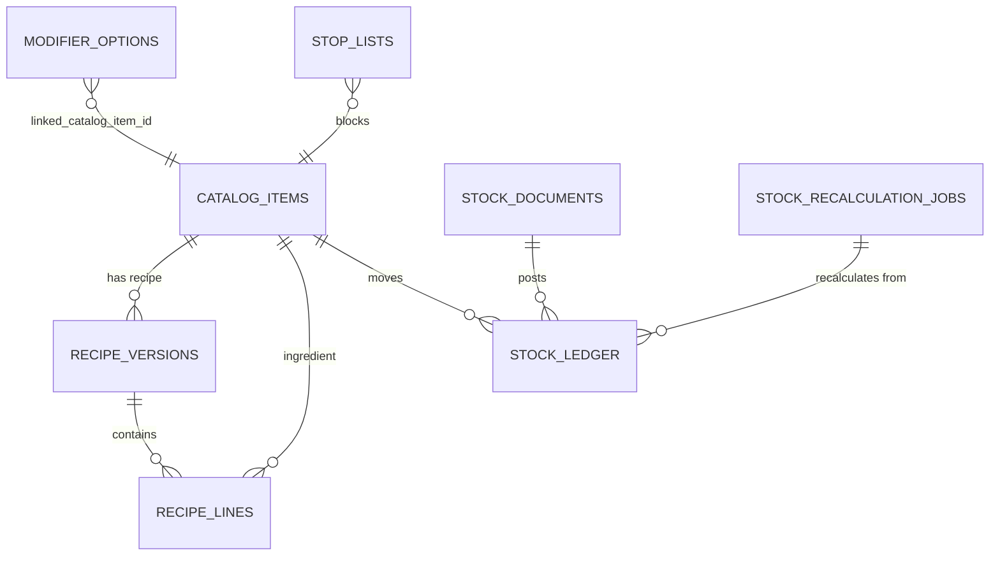

# Inventory And Costing Spec

Статус: запланировано далее, архитектурные принципы заморожены для будущей реализации.

Этот документ является source of truth для дальнейшей реализации склада, stop-list, рецептурного списания и себестоимости. Он заменяет прежнюю идею, где POS Edge сам создавал `StockDocument`, `StockMove` и считал остатки.

## Freezed Principles

- POS Edge и KDS являются генераторами неизменяемых business events и интерфейсом ввода данных.
- POS Edge не создает складские документы, складские проводки и не считает себестоимость.
- Cloud является единственным источником истины для склада, себестоимости, пересчета и аналитического журнала движений.
- Остаток склада является аналитическим показателем, допускает отрицательные значения и не блокирует продажу.
- Продажу блокирует только `StopList`, синхронизируемый в обе стороны.
- ClickHouse используется как immutable event archive и OLAP слой для аналитики, не как transactional source of truth.

## Architecture And Data Flow

Целевой поток:

```text
POS Edge / KDS
  -> Edge outbox business events
  -> Cloud API (PostgreSQL inbox_events)
     -> Async Batch Forwarder -> ClickHouse raw_business_events
     -> Inventory Worker -> PostgreSQL stock_ledger / stock_documents / costing state
     -> ClickHouse olap_stock_moves
```

POS Edge сохраняет cashier/KDS факты локально и отправляет события через outbox. Cloud API принимает события идемпотентно, пишет их в PostgreSQL `inbox_events` и не выполняет synchronous dual-write в ClickHouse. Async Batch Forwarder экспортирует события в ClickHouse `raw_business_events`. Inventory Worker асинхронно обрабатывает accepted events, разворачивает рецепты, применяет stop-list side effects, создает Cloud-owned складские документы и пишет хронологический `stock_ledger`.

PostgreSQL хранит транзакционный журнал и состояния пересчета. ClickHouse хранит immutable `raw_business_events` бессрочно, а также получает батчевую проекцию `olap_stock_moves` для отчетов по COGS, расходу, маржинальности, списаниям, остаткам и кухонной аналитике.

## POS Edge SQLite Target Schema

Запланировано далее:

- Удалить из POS Edge SQLite целевой схемы `stock_documents`, `stock_moves`, `stock_balances`, `item_costs`, `purchase_receipts`, `purchase_receipt_lines`.
- Оставить `recipe_versions` и `recipe_lines` как read-only reference tables, которыми владеет Cloud.
- Добавить `stop_lists` как локальный read/write overlay, синхронизируемый в обе стороны.

Целевые Edge таблицы для склада:

```text
recipe_versions
recipe_lines
stop_lists
```

`recipe_versions` и `recipe_lines` нужны Edge только для KDS UI и локальной проверки stop-list. Они не дают Edge права создавать stock moves.

`stop_lists`:

| Column | Type | Правило |
| --- | --- | --- |
| `id` | UUID v7 | стабильный id записи |
| `restaurant_id` | UUID v7 | ресторан |
| `catalog_item_id` | UUID v7 | блюдо, товар или заготовка |
| `available_quantity` | DECIMAL nullable | `0` блокирует продажу; `null` означает флаговый stop без счетчика |
| `source` | TEXT | `edge`, `cloud`, `sync` |
| `reason` | TEXT nullable | безопасный операторский reason |
| `active` | BOOLEAN | активность overlay |
| `cloud_version` | INTEGER nullable | версия Cloud package |
| `updated_at` | TIMESTAMP | время изменения |

## Cloud PostgreSQL Target Schema

Cloud PostgreSQL владеет transactional inventory model:

- `stock_documents` - Cloud-owned документы типов `SALE`, `RETURN`, `WASTE`, `PRODUCTION`, `PURCHASE`, `ADJUSTMENT`, `TRANSFER`, `INVENTORY_COUNT`.
- `stock_ledger` - immutable хронологический журнал проводок с unit cost.
- `stock_recalculation_jobs` - очередь ретроспективного пересчета.
- `stop_lists` - authoritative stop-list state с двусторонней синхронизацией.
- `modifier_options.linked_catalog_item_id` - опциональная ссылка на складской catalog item.
- `olap_stock_moves` - ClickHouse проекция, не PostgreSQL source table.

Минимальная структура `stock_ledger`:

| Column | Type | Правило |
| --- | --- | --- |
| `id` | UUID v7 | id проводки |
| `restaurant_id` | UUID v7 | tenant boundary |
| `stock_document_id` | UUID v7 | Cloud-owned документ |
| `source_event_id` | UUID v7 | исходное Edge/Cloud событие |
| `source_event_type` | TEXT | например `CheckClosed`, `ItemServed`, `ProductionCompleted` |
| `catalog_item_id` | UUID v7 | товар, ингредиент, заготовка или блюдо |
| `order_line_id` | UUID v7 nullable | связь с позицией заказа |
| `movement_type` | TEXT | `IN` или `OUT` |
| `quantity` | DECIMAL | signed quantity в базовой единице |
| `unit_code` | TEXT | machine code единицы |
| `unit_cost_minor` | INTEGER | себестоимость единицы на момент события |
| `total_cost_minor` | INTEGER | `quantity * unit_cost_minor` с правилами округления |
| `costing_status` | TEXT | `final`, `estimated`, `needs_recalculation`, `recalculated`, `failed` |
| `occurred_at` | TIMESTAMP | business event time |
| `business_date_local` | DATE | дата ресторана |
| `created_at` | TIMESTAMP | запись в Cloud |

ER target:



## Stop-List Logic

`StopList` блокирует продажу независимо от аналитического stock balance. Запись может относиться к `dish`, `good` или `semi_finished`.

Правила POS Edge при добавлении позиции:

1. Проверить сам `catalog_item_id` блюда в локальном `stop_lists`.
2. Развернуть локальную read-only рецептуру через `recipe_versions` и `recipe_lines`.
3. Проверить все обязательные ингредиенты и заготовки рецепта.
4. Если блюдо или хотя бы один обязательный компонент имеет активную запись с `available_quantity = 0`, отклонить добавление позиции.
5. Если stop-list отсутствует или `available_quantity > 0`, продажа разрешена. Stock balance при этом не проверяется.

Изменение stop-list может прийти из Cloud admin UI или быть создано менеджером на Edge. В обоих случаях публикуется `StopListUpdated`.

## Modifier Inventory Rule

На POS Edge modifier является только выбранной опцией с ценой: `modifier_option_id`, quantity, unit price и total price.

Cloud справочник `ModifierOption` может иметь `linked_catalog_item_id`. POS Edge не знает и не применяет эту связь. Если связь есть, Inventory Worker при обработке продажи генерирует отдельное списание linked catalog item. Если связи нет, modifier влияет только на цену и snapshots.

## Edge Outbox Event Contracts

Все события отправляются в стандартном sync envelope. Ниже указаны payload fragments внутри `payload.data`.

### CheckClosed

`CheckClosed` является финальным batch trigger для заказа. Worker использует его для delta consumption: списывает только позиции, которые еще не были списаны по `ItemServed`.

```json
{
  "check_id": "018f0000-0000-7000-8000-000000000001",
  "order_id": "018f0000-0000-7000-8000-000000000002",
  "precheck_id": "018f0000-0000-7000-8000-000000000003",
  "restaurant_id": "018f0000-0000-7000-8000-000000000004",
  "business_date_local": "2026-05-19",
  "closed_at": "2026-05-19T12:40:00Z",
  "items": [
    {
      "order_line_id": "018f0000-0000-7000-8000-000000000010",
      "catalog_item_id": "018f0000-0000-7000-8000-000000000020",
      "quantity": "2.000",
      "unit_code": "PC",
      "required_for_inventory": true,
      "modifiers": [
        {
          "order_line_modifier_id": "018f0000-0000-7000-8000-000000000030",
          "modifier_option_id": "018f0000-0000-7000-8000-000000000031",
          "quantity": "1.000"
        }
      ]
    }
  ]
}
```

### ItemServed

`ItemServed` фиксирует KDS факт подачи гостю и может вызвать раннее списание позиции. Cloud обязан дедуплицировать его с последующим `CheckClosed`.

```json
{
  "served_event_id": "018f0000-0000-7000-8000-000000000101",
  "order_id": "018f0000-0000-7000-8000-000000000002",
  "order_line_id": "018f0000-0000-7000-8000-000000000010",
  "catalog_item_id": "018f0000-0000-7000-8000-000000000020",
  "quantity": "1.000",
  "unit_code": "PC",
  "served_at": "2026-05-19T12:25:00Z",
  "station_id": "kitchen-hot"
}
```

### StockReceiptCaptured

```json
{
  "receipt_id": "018f0000-0000-7000-8000-000000000201",
  "restaurant_id": "018f0000-0000-7000-8000-000000000004",
  "received_at": "2026-05-19T08:00:00Z",
  "business_date_local": "2026-05-19",
  "supplier_id": "018f0000-0000-7000-8000-000000000202",
  "items": [
    {
      "catalog_item_id": "018f0000-0000-7000-8000-000000000203",
      "quantity": "10.000",
      "unit_code": "KG",
      "unit_cost_minor": 5000,
      "currency": "RUB"
    }
  ]
}
```

### InventoryCountCaptured

```json
{
  "count_id": "018f0000-0000-7000-8000-000000000301",
  "restaurant_id": "018f0000-0000-7000-8000-000000000004",
  "counted_at": "2026-05-19T21:00:00Z",
  "business_date_local": "2026-05-19",
  "items": [
    {
      "catalog_item_id": "018f0000-0000-7000-8000-000000000203",
      "counted_quantity": "3.250",
      "unit_code": "KG"
    }
  ]
}
```

### ProductionCompleted

```json
{
  "production_id": "018f0000-0000-7000-8000-000000000401",
  "restaurant_id": "018f0000-0000-7000-8000-000000000004",
  "semi_finished_catalog_item_id": "018f0000-0000-7000-8000-000000000402",
  "quantity": "5.000",
  "unit_code": "KG",
  "completed_at": "2026-05-19T10:15:00Z",
  "business_date_local": "2026-05-19"
}
```

### RefundRecorded / CancellationRecorded

`RefundRecorded` и `CancellationRecorded` должны передавать disposition на уровне каждой возвращаемой строки.

```json
{
  "operation_id": "018f0000-0000-7000-8000-000000000501",
  "operation_type": "refund",
  "check_id": "018f0000-0000-7000-8000-000000000001",
  "business_date_local": "2026-05-19",
  "recorded_at": "2026-05-19T14:00:00Z",
  "items": [
    {
      "order_line_id": "018f0000-0000-7000-8000-000000000010",
      "catalog_item_id": "018f0000-0000-7000-8000-000000000020",
      "quantity": "1.000",
      "inventory_disposition": "return_to_stock",
      "reason": "sealed_item_returned"
    },
    {
      "order_line_id": "018f0000-0000-7000-8000-000000000011",
      "catalog_item_id": "018f0000-0000-7000-8000-000000000021",
      "quantity": "1.000",
      "inventory_disposition": "write_off_waste",
      "reason": "guest_returned_open_food"
    }
  ]
}
```

Допустимые `inventory_disposition`: `return_to_stock`, `write_off_waste`, `no_stock_effect`.

### StopListUpdated

```json
{
  "stop_list_id": "018f0000-0000-7000-8000-000000000601",
  "restaurant_id": "018f0000-0000-7000-8000-000000000004",
  "catalog_item_id": "018f0000-0000-7000-8000-000000000020",
  "available_quantity": "0.000",
  "active": true,
  "source": "edge",
  "reason": "ingredient_unavailable",
  "updated_at": "2026-05-19T12:05:00Z"
}
```

## Deduplication Between KDS And POS

`ItemServed` может списать позицию до закрытия чека. `CheckClosed` остается обязательным финальным событием для заказа.

Алгоритм Inventory Worker:

1. Принять `ItemServed` идемпотентно по `served_event_id`.
2. Создать Cloud `StockDocument` типа `SALE` для served quantity или записать served allocation в staging, если документальная политика требует batch posting.
3. При `CheckClosed` прочитать все позиции чека и все уже обработанные `ItemServed` allocations по `order_line_id`.
4. Рассчитать delta: `check_line_quantity - served_quantity`.
5. Для delta больше нуля создать единый `StockDocument` типа `SALE`.
6. Для delta равного нулю не создавать повторных списаний.
7. Для отрицательной delta отправить событие в reconciliation queue и пометить конфликт как требующий ручного разбора.

## Auto-Production And Nested Consumption

`ProductionCompleted` вне заказа создает Cloud `StockDocument` типа `PRODUCTION`: приходует заготовку и списывает сырье по рецепту.

При продаже блюда Worker применяет иерархическое списание:

1. Развернуть проданную позицию до recipe components.
2. Если компонент является `semi_finished`, сначала попытаться списать его остаток.
3. Если остатка хватает, списать заготовку как обычный `OUT`.
4. Если остатка не хватает, выполнить split:
   - списать доступное количество заготовки;
   - недостающую часть развернуть по рецепту заготовки;
   - списать сырые ингредиенты недостающей части.
5. Повторять разворачивание по DAG рецептов, запрещая циклы.

Если рецепта нет или он не опубликован, Worker списывает сам `catalog_item_id` как товар. Это fallback не должен создавать stop-list блокировки по stock balance.

## Costing Engine

Себестоимость пишется в `stock_ledger.unit_cost_minor` и `total_cost_minor` на момент обработки события. Отрицательные остатки допустимы.

Жесткие правила:

1. Если товар списывается в минус и истории приходов до даты события нет, `unit_cost_minor = 0`.
2. Если товар уходит в минус, но ранее были приходы, применяется последняя известная цена для всего списания, уводящего в минус.
3. Ввод приходной накладной задним числом влияет только на события с `occurred_at` начиная с даты этой накладной. Более ранние чеки не пересчитываются по новой цене.
4. Создание или редактирование документа в прошлом запускает `stock_recalculation_jobs`.
5. Recalculation Worker строит DAG зависимостей `raw goods -> semi_finished -> dishes` и пересчитывает `stock_ledger` хронологически от даты измененного документа.

`costing_status`:

- `final` - стоимость рассчитана по актуальной истории.
- `estimated` - применена последняя известная цена при отрицательном остатке.
- `needs_recalculation` - запись затронута документом в прошлом.
- `recalculated` - запись пересчитана worker.
- `failed` - пересчет не завершен, требуется операторский разбор.

## Refund And Cancellation Inventory Disposition

При возврате или отмене менеджер принимает решение по каждой строке:

- `return_to_stock` - Worker создает возвратное движение `IN`.
- `write_off_waste` - Worker создает документ порчи/утиля `WASTE`.
- `no_stock_effect` - Worker не создает складского движения.

Whole-check операции должны быть нормализованы до массива строк из immutable check snapshot до передачи в Inventory Worker. Нельзя использовать один общий disposition для всех строк, если оператор выбрал разные решения по позициям.

## Implementation Notes

Запланировано далее:

- вывести из целевой архитектуры legacy POS Edge manual stock document service;
- удалить Edge-side stock tables из managed SQLite baseline;
- добавить `stop_lists` и Cloud -> Edge / Edge -> Cloud sync для stop-list;
- расширить Cloud receiver catalog событий;
- реализовать durable queue и Inventory Worker;
- добавить PostgreSQL `stock_ledger`, `stock_recalculation_jobs` и Cloud-owned stock documents;
- добавить batch export в ClickHouse `olap_stock_moves`;
- покрыть дедупликацию `ItemServed`/`CheckClosed`, auto-production split и retro costing тестами.

Вне текущего объема:

- использовать ClickHouse как transactional source of truth;
- блокировать продажи по stock balance;
- создавать складские проводки на POS Edge;
- раскрывать `linked_catalog_item_id` modifier option в Edge runtime.
