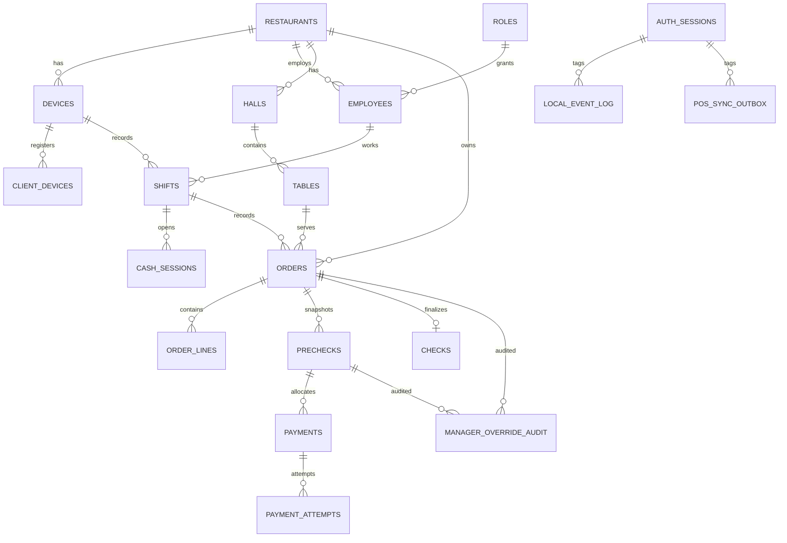

# Модель данных POS и policy миграций

## Назначение

Документ описывает:

- ключевые сущности локального Edge runtime;
- связи между сущностями;
- обязательные инварианты данных;
- first-launch migration policy;
- правила изменения схемы до первого пилота.

## Главный принцип

До первого пилота действует **reset policy**, а не legacy migration policy.

Это означает:

- нет production data, которую нужно сохранять;
- нет смысла строить историческую цепочку dev-миграций;
- каноническая локальная схема определяется одним first-launch init script;
- при изменении схемы dev/test базы пересоздаются.

## Канонический SQLite path

Pilot path для SQLite:

- один `001_init.sql`;
- одна запись `001_init.sql` в `schema_migrations`;
- никаких обязательных historical alter-migrations до first pilot.

## Владение сущностями

Архитектурная карта владения находится в `docs/architecture/DDD-CONTEXT-MAP.md`. Этот документ описывает только схему, связи, инварианты и migration/reset policy.

Краткая привязка таблиц к контекстам:

- `Organization`: `restaurants`, `devices`, `edge_node_identity`, `client_devices`, `roles`, `employees`, `auth_sessions`.
- `Reservation / Table`: `halls`, `tables`.
- `Catalog`: `catalog_items`, `menu_items`, `recipe_versions`, `recipe_lines`.
- `Pricing`: сейчас использует упрощенное хранение `menu_items.price`; это MVP price surface, а не финальное владение pricing внутри `Catalog`.
- `Order`: `orders`, `order_lines`, `prechecks`.
- `Payment`: `payments`, `payment_attempts`.
- `Fiscal / Tax`: `checks` как финальный immutable document foundation; real fiscalization вне текущего runtime.
- `Staff / Shift`: `shifts`, `cash_sessions`, `cash_drawer_events`, `manager_override_audit`.
- `Inventory`: `stock_documents`, `stock_moves`, `stock_balances`, `item_costs`, recipe consumption foundation.
- `Procurement`: `purchase_receipts`, `purchase_receipt_lines` существуют как inventory/procurement foundation; полный `Procurement` context остается после пилота, если не будет отдельного решения.
- `Event / Integration`: `local_event_log`, `pos_sync_outbox`, `cloud_master_sync_state`.

## Ключевые runtime-сущности

### Identity и организация

- `restaurants`
- `devices`
- `edge_node_identity`
- `client_devices`
- `roles`
- `employees`
- `auth_sessions`

### Залы и sales runtime

- `halls`
- `tables`
- `catalog_items`
- `menu_items`
- `shifts` как личные смены сотрудников
- `orders`
- `order_lines`
- `prechecks`
- `checks`
- `payments`
- `payment_attempts`

### Касса и sync

- `cash_sessions` как кассовые смены
- `cash_drawer_events`
- `manager_override_audit`
- `cloud_master_sync_state`
- `local_event_log`
- `pos_sync_outbox`

### Foundation будущего inventory

- `recipe_versions`
- `recipe_lines`
- `purchase_receipts`
- `purchase_receipt_lines`
- `stock_documents`
- `stock_moves`
- `stock_balances`
- `item_costs`

## Схема связей

Реализовано сейчас:

- `auth_sessions` фиксируют техническую авторизацию `node_device_id + client_device_id + employee_id` и не являются рабочей сменой.
- `shifts` фиксируют личную смену сотрудника. Открытая личная смена уникальна для пары `restaurant_id + opened_by_employee_id`.
- `cash_sessions` фиксируют кассовую смену устройства и открываются только при открытой личной смене текущего сотрудника.
- `orders.shift_id`, `payments.shift_id`, `cash_sessions.shift_id`, `cash_drawer_events.shift_id` указывают на личную смену сотрудника.

Запланировано далее:

- Личная смена сотрудника станет входной сущностью для post-MVP учета рабочего времени.



## Обязательные текущие инварианты

### Orders

- только один активный order per selected runtime context;
- order открывается только при активной смене;
- order блокируется при issue precheck;
- редактирование order запрещено при active issued precheck;
- order закрывается только после полной оплаты и final check.

### Prechecks

- активным может быть только один `issued` precheck на order;
- у precheck должен быть положительный `version`;
- `paid_total` не может превышать `total`;
- terminal precheck state требует `closed_at`.

### Payments

- payment immutable;
- payment ссылается на `precheck_id`, а не на legacy `check_id`;
- `business_date_local` вычисляется backend в момент capture payment и после записи immutable;
- payment attempt - отдельная сущность истории попыток.

### Checks

- final check immutable после создания;
- `business_date_local` вычисляется backend в момент создания final check;
- `closed_at` хранит фактическое время закрытия;
- `snapshot` хранит immutable JSON source для reprint.

### Prechecks

- `snapshot` хранит immutable JSON source для reprint precheck;
- reprint не использует текущее состояние order.

### Outbox

- `sequence_no` - канонический local ordering key;
- `sync_direction` явно фиксирует `edge_to_cloud`, `cloud_to_edge` или `local_only`;
- запись в business tables, `local_event_log` и `pos_sync_outbox` должна быть транзакционной;
- failed/suspended retry выполняется через явный operational path;
- item-level batch ACK реализован: Edge sender применяет per-item результаты Cloud batch endpoint к lifecycle строк `pos_sync_outbox`.

### Directional ownership

Реализовано сейчас:

- Cloud-owned master tables: `restaurants`, `devices`, `roles`, `employees`, `halls`, `tables`, `catalog_items`, `menu_items`, `recipe_versions`, `recipe_lines`, `item_costs`.
- Эти таблицы являются локальной read model на POS Edge; application services запрещают Edge runtime mutation и принимают только `origin = cloud_sync` или `origin = system_seed`.
- Реализовано сейчас: Cloud-authored rows применяются на POS Edge через `POST /api/v1/sync/master-data/snapshots` или `POST /api/v1/sync/master-data/{stream}`. Supported Edge ingest streams: `restaurants`, `devices`, `staff`, `floor`, `catalog`, `menu`.
- Вне текущего объема: POS Edge apply for `currencies` stream. Cloud backend owns canonical ISO 4217 reference/provisioning, while current POS Edge currency validation uses the local canonical catalog.
- Cloud-owned master tables имеют `cloud_version`, `cloud_updated_at`, `cloud_deleted_at`, `last_synced_at`.
- `cloud_master_sync_state` хранит Cloud -> Edge stream checkpoint: stream, mode, checkpoint token, last Cloud version/update, last apply time, status/error.
- Master-data ingest writes master rows and `cloud_master_sync_state` in one transaction and does not write `local_event_log` or `pos_sync_outbox`.
- Edge-owned operational tables: `shifts`, `cash_sessions`, `cash_drawer_events`, `orders`, `order_lines`, `prechecks`, `payments`, `payment_attempts`, `checks`, `manager_override_audit`, `auth_sessions`, `local_event_log`, `pos_sync_outbox`.

## Обязательные policy-решения до первого пилота

### Money contract

Для новых и меняемых финансовых полей использовать:

- signed integer minor units;
- explicit currency code;
- no REAL/FLOAT money storage.

### Business date

Реализовано сейчас:

- `restaurants.business_day_mode` задает режим `standard` или `24_7`;
- `restaurants.business_day_boundary_local_time` хранит ресторанную границу дня в формате `HH:MM`;
- `checks.business_date_local` и `payments.business_date_local` являются обязательными финансовыми полями;
- `shifts.business_date_local` и `cash_sessions.business_date_local` сохраняют учетный день открытия для связности отчетов;
- в `standard` режиме backend вычисляет учетный день по локальному времени ресторана с учетом границы дня;
- в `24_7` режиме backend использует локальную календарную дату события;
- после создания checks/payments `business_date_local` immutable.

### Print snapshots

Реализовано сейчас:

- `prechecks.snapshot` хранит immutable JSON snapshot на момент issue precheck;
- `checks.snapshot` хранит immutable JSON snapshot на момент final check creation;
- reprint precheck/check читает только snapshot;
- reprint events `PrecheckReprinted` / `CheckReprinted` пишутся в `local_event_log` и `pos_sync_outbox`.

### Pairing secret verifier

Реализовано сейчас: verifier-side storage pairing code использует keyed format `pairing.hmac-sha256.v1`.
Plain hash для pairing verifier запрещен в canonical first-launch schema/runtime.

### Employee credential policy

Реализовано сейчас: PIN login должен однозначно определить одного active employee в пределах paired restaurant.
Если один PIN совпал с несколькими active employees, login отклоняется как policy conflict.
Employee selection login flow остается вне текущего объема для текущего cashier-first pilot surface.

## Вне текущего объема до отдельного пилотного решения

Без отдельного пилотного решения не считаются реализованными сейчас:

- `precheck_lines` snapshots;
- `precheck_tax` snapshots;
- полный refund ledger flow;
- hardware printer adapter layer;
- ручной перенос closed order/payment в другой business date;
- broadly enforced STRICT tables across all financial tables.

## Правило изменения схемы

Любое изменение схемы до первого пилота делается так:

1. меняется canonical `001_init.sql`;
2. обновляются schema tests;
3. при необходимости обновляются seed/tests;
4. обновляются backend docs;
5. dev/test DBs пересоздаются.

Нельзя:

- добавлять historical migration only because “так привычнее”;
- сохранять legacy поля ради несуществующей production совместимости;
- добавлять новый financial path рядом со старым.

## Runtime version contract и backup-before-upgrade

Реализовано сейчас:

- для `SQLite` и `PostgreSQL` поддерживается таблица `db_runtime_versions` (module name -> module version);
- модульные версии берутся из единого `MH_POS_VERSION` (fallback `0.1.0`);
- миграции выполняются программно на старте модулей;
- если обнаружена ситуация `db version < module version`, перед обновлением схемы обязателен backup:
  - POS Edge (`SQLite`): файловый backup DB/WAL/SHM;
  - Cloud (`PostgreSQL`): JSONL snapshot таблиц `public` схемы.

Запланировано далее:

- добавить retention/purge policy для backup-артефактов и централизованный мониторинг успешности backup-before-upgrade.

## SQLite maintenance: VACUUM / VACUUM INTO

Реализовано сейчас:

- `VACUUM`, `VACUUM INTO`, `PRAGMA optimize` и `PRAGMA wal_checkpoint(TRUNCATE)` считаются явными maintenance/snapshot операциями.
- Эти операции не выполняются автоматически на каждом startup и не входят в обычный POS write path.
- `VACUUM` и `VACUUM INTO` запускаются только с явным подтверждением `-force`, чтобы не создать долгую блокирующую операцию случайно.
- PowerShell wrapper: `scripts/maintain-sqlite.ps1`.
- Go CLI: `pos-backend/cmd/sqlite-maintenance`.
- Команды выполняются вне активной write transaction.
- `VACUUM INTO` используется для compact snapshot/backup file, если нужен новый целевой файл; существующий target file не перезаписывается.

Примеры:

```powershell
.\scripts\maintain-sqlite.ps1 -DatabasePath "pos-backend\data\pos-edge.db" -Optimize -WalCheckpoint
.\scripts\maintain-sqlite.ps1 -DatabasePath "pos-backend\data\pos-edge.db" -Vacuum -Force
.\scripts\maintain-sqlite.ps1 -DatabasePath "pos-backend\data\pos-edge.db" -VacuumInto "pos-backend\data\snapshots\pos-edge.compact.db" -Force
```

Риски:

- `VACUUM` может занять заметное время на большой базе и требует свободное место.
- `VACUUM` не должен запускаться внутри active write transaction.
- Для production-like данных перед тяжелой maintenance-операцией нужен отдельный backup/snapshot.

Запланировано далее:

- добавить retention policy для maintenance snapshots;
- добавить отдельный health/report output с размером DB/WAL до и после операции.

## Правило compatibility-хвостов на уровне данных

Запрещены бессрочные data-model tails:

- legacy foreign key path;
- duplicate meaning columns;
- old/new enum names without removal plan;
- shadow table for obsolete runtime.

Если compatibility column временно нужен для transport layer, это должно быть явно отражено и иметь milestone удаления.

## Минимальный verification set

После изменений схемы разработчик обязан проверить:

- clean install проходит;
- `schema_migrations` содержит только canonical init;
- runtime tests не создают legacy payment-to-check coupling;
- precheck lifecycle constraints и outbox constraints не сломаны;
- документация отражает новое состояние схемы.
