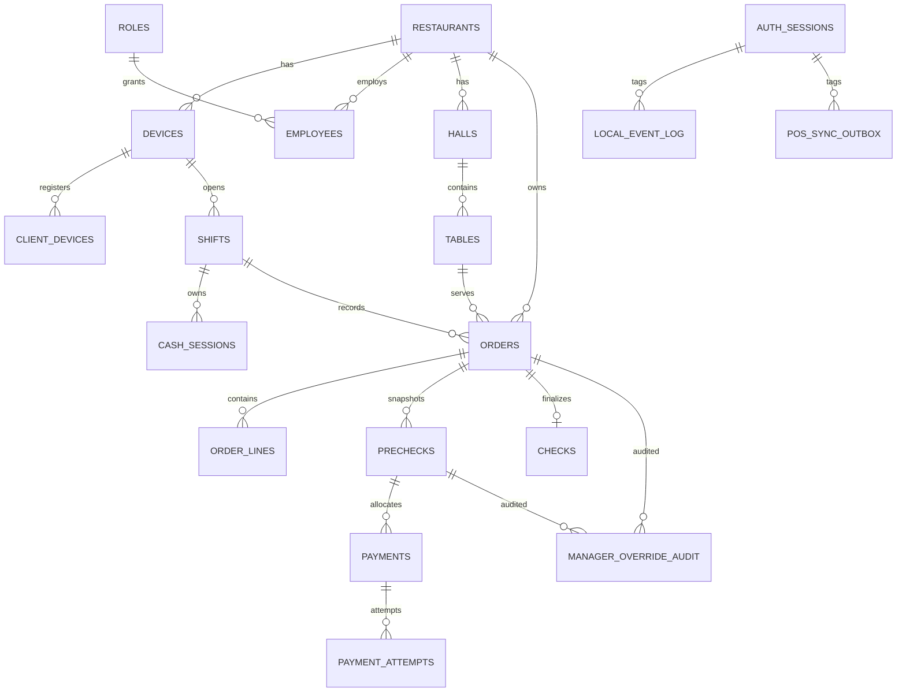

# Модель данных POS и policy миграций

## Назначение

Документ описывает:

- ключевые сущности локального Edge runtime;
- связи между сущностями;
- обязательные инварианты данных;
- first-launch migration policy;
- правила изменения схемы до первого пилота.

## Главный принцип

До первого пилота действует **reset policy**, а не legacy migration policy.

Это означает:

- нет production data, которую нужно сохранять;
- нет смысла строить историческую цепочку dev-миграций;
- каноническая локальная схема определяется одним first-launch init script;
- при изменении схемы dev/test базы пересоздаются.

## Канонический SQLite path

Pilot path для SQLite:

- один `001_init.sql`;
- одна запись `001_init.sql` в `schema_migrations`;
- никаких обязательных historical alter-migrations до first pilot.

## Ключевые runtime-сущности

### Identity и организация

- `restaurants`
- `devices`
- `edge_node_identity`
- `client_devices`
- `roles`
- `employees`
- `auth_sessions`

### Залы и sales runtime

- `halls`
- `tables`
- `catalog_items`
- `menu_items`
- `shifts`
- `orders`
- `order_lines`
- `prechecks`
- `checks`
- `payments`
- `payment_attempts`

### Касса и sync

- `cash_sessions`
- `cash_drawer_events`
- `manager_override_audit`
- `local_event_log`
- `pos_sync_outbox`

### Foundation будущего inventory

- `recipe_versions`
- `recipe_lines`
- `purchase_receipts`
- `purchase_receipt_lines`
- `stock_documents`
- `stock_moves`
- `stock_balances`
- `item_costs`

## Схема связей

## Обязательные текущие инварианты

### Orders

- только один активный order per selected runtime context;
- order открывается только при активной смене;
- order блокируется при issue precheck;
- редактирование order запрещено при active issued precheck;
- order закрывается только после полной оплаты и final check.

### Prechecks

- активным может быть только один `issued` precheck на order;
- у precheck должен быть положительный `version`;
- `paid_total` не может превышать `total`;
- terminal precheck state требует `closed_at`.

### Payments

- payment immutable;
- payment ссылается на `precheck_id`, а не на legacy `check_id`;
- payment attempt - отдельная сущность истории попыток.

### Outbox

- `sequence_no` - канонический local ordering key;
- запись в business tables, `local_event_log` и `pos_sync_outbox` должна быть транзакционной;
- failed/suspended retry выполняется через явный operational path.

## Обязательные policy-решения до первого пилота

### Money contract

Для новых и меняемых финансовых полей использовать:

- signed integer minor units;
- explicit currency code;
- no REAL/FLOAT money storage.

### Business date

Для смен, кассовых сессий и финансовых документов должен быть закреплен единый policy по `business_date_local`.

Если поле еще не внедрено повсеместно, это должно быть отмечено как pilot blocker, а не как “потом разберемся”.

### Print snapshots

Если планируется reprint precheck/check, snapshot source и правила его хранения должны быть оформлены в схеме/документации до включения reprint в supported scope.

### Pairing secret verifier

Verifier-side storage pairing code должен использовать keyed format.
Plain hash считается временным состоянием и не должен пережить pre-pilot hardening.

### Employee credential policy

Должна быть описана одна из двух политик:

- PIN уникален в пределах ресторана;
- login требует явного выбора сотрудника + PIN.

Неявный компромисс не допускается.

## Что пока считается future work

Без отдельного пилотного решения не считаются implemented now:

- `precheck_lines` snapshots;
- `precheck_tax` snapshots;
- полный refund ledger flow;
- полная print snapshot model;
- full business-date propagation на все сущности;
- broadly enforced STRICT tables across all financial tables;
- sender-side item-level batch ACK integration.

## Правило изменения схемы

Любое изменение схемы до первого пилота делается так:

1. меняется canonical `001_init.sql`;
2. обновляются schema tests;
3. при необходимости обновляются seed/tests;
4. обновляются backend docs;
5. dev/test DBs пересоздаются.

Нельзя:

- добавлять historical migration only because “так привычнее”;
- сохранять legacy поля ради несуществующей production совместимости;
- добавлять новый financial path рядом со старым.

## Правило compatibility-хвостов на уровне данных

Запрещены бессрочные data-model tails:

- legacy foreign key path;
- duplicate meaning columns;
- old/new enum names without removal plan;
- shadow table for obsolete runtime.

Если compatibility column временно нужен для transport layer, это должно быть явно отражено и иметь milestone удаления.

## Минимальный verification set

После изменений схемы разработчик обязан проверить:

- clean install проходит;
- `schema_migrations` содержит только canonical init;
- runtime tests не создают legacy payment-to-check coupling;
- precheck lifecycle constraints и outbox constraints не сломаны;
- документация отражает новое состояние схемы.
