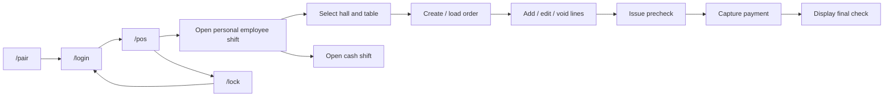

# Спецификация POS UI

## Назначение

Этот документ описывает **текущий и целевой UI surface** пакета `pos-ui`.

Он не описывает backend domain logic.
Он не подменяет backend API spec.
Он не подменяет RBAC matrix.

## Текущее состояние

`pos-ui` на текущем этапе - это cashier-first UI для одного all-in-one pilot terminal.

Реально поддерживаемые маршруты:

- `/pair`
- `/login`
- `/pos`
- `/lock`

Route `/` используется только как redirect entrypoint.

## Архитектурная позиция

Frontend не является source of truth.

Frontend:

- показывает состояние;
- отправляет команды в backend;
- не принимает финансовых решений;
- использует backend-provided permission model для UX visibility, но не является security boundary;
- не считает order/precheck/check totals;
- не определяет самостоятельно, можно ли закрыть заказ, отменить пречек или завершить оплату.

Все бизнес-решения принимает Edge backend.

## Identity model

UI использует два идентификатора устройства:

- `node_device_id` - identity Edge backend / Edge node;
- `client_device_id` - identity конкретного UI-клиента.

Правила:

- `node_device_id` не генерируется frontend;
- `node_device_id` приходит через pairing;
- `client_device_id` генерируется frontend через `crypto.randomUUID()` и хранится локально;
- все operator commands должны нести session/device/actor metadata.

## Экраны

### Pair

Назначение:

- первичное связывание UI-клиента с Edge node.

Действия:

- ввод pairing code;
- вызов `POST /api/v1/system/pair`;
- переход на `/login` после успешного pairing.

### Login

Назначение:

- вход сотрудника по PIN.

Действия:

- ввод PIN;
- вызов `POST /api/v1/auth/pin-login`;
- получение session + actor context + permissions;
- переход на `/pos`.

Реализовано сейчас: backend отклоняет login, если PIN совпадает с несколькими active employees; текущий UI не реализует employee selection flow.

### POS

Назначение:

- основной cashier terminal flow.

Реализовано сейчас:

- `/pos` использует touch-first трехзонную компоновку для all-in-one terminal: слева готовность личной/кассовой смены и выбор зала/стола, в центре активный заказ и позиции, справа поиск меню, пречек и оплата.
- Меню отображается крупными плитками с локальным поиском по названию позиции; поиск является только UX-фильтром уже загруженного backend menu read model.
- Столы отображаются крупными touch-карточками внутри выбранного зала; текущий UI показывает active tables из backend, но не делает выводы об occupancy beyond selected table/current order.
- Статусы смены, кассовой смены, pairing, node и session вынесены в верхний service strip; это не меняет backend enforcement и не добавляет новые runtime endpoints.
- Кассовые операции `cash_in`, `cash_out`, `no_sale`, `cash_count` доступны из блока кассового ящика при `pos.cash_drawer.record_event` и открытой кассовой смене.
- Менеджерский sync-блок показывает `sync/status`, последние `sync/outbox`, последние `sync/local-events` и позволяет выполнить `sync/retry-failed` при соответствующих backend permission ids.

Поддерживаемые блоки:

- текущий оператор и session status;
- pairing/session status strip;
- open/close personal employee shift;
- last personal employee shifts;
- open/close cash shift;
- запись событий кассового ящика;
- halls list;
- tables list;
- active order by selected table;
- order creation;
- add line;
- change quantity;
- void line;
- issue precheck;
- cancel precheck через manager override dialog;
- reprint precheck copy при наличии `pos.precheck.reprint`;
- cash payment;
- trusted manual card payment;
- закрытие полностью оплаченного заказа;
- reprint final check copy при наличии `pos.check.reprint`;
- final check display.
- диагностика синхронизации для ролей с `pos.sync.view`;
- retry failed sync для ролей с `pos.sync.retry_failed`.

### Lock

Назначение:

- завершение локальной рабочей сессии.

Действия:

- backend logout;
- очистка локального session state;
- переход к `/login`.

## Реализованный пользовательский поток

## Server-state и local-state

### Server state

Через query-layer загружаются:

- pairing status;
- auth session;
- current personal employee shift;
- recent personal employee shifts;
- current cash shift;
- halls;
- tables;
- current order by table;
- order by id;
- prechecks by order;
- menu items;
- final check.
- статус синхронизации;
- строки sync outbox;
- строки local event log.

Реализовано сейчас:

- Без открытой личной смены сотрудника `/pos` показывает только действие открытия личной смены и последние личные смены текущего actor.
- Создание и редактирование заказов доступно после открытия личной смены сотрудника и не требует кассовой смены.
- Оплата доступна только при открытой кассовой смене.
- Оплата скрыта/заблокирована без `pos.payment.*`; waiter payment остается вне текущего объема.
- Reprint precheck/check отображается только при соответствующих backend permissions и вызывает backend audit command.
- События кассового ящика отображаются только при открытой кассовой смене и `pos.cash_drawer.record_event`; суммы отправляются в backend в minor units.
- Закрытие заказа отображается только после полной оплаты backend check и `pos.order.close`.
- Диагностика синхронизации отображается только при `pos.sync.view`, retry failed/suspended outbox rows - только при `pos.sync.retry_failed`.
- visibility критичных действий в `/pos` привязана к backend permission ids (shift/cash/order/precheck/payment/floor/menu); backend остается final enforcement layer.
- денежный ввод/показ в UI использует currency precision helper по ISO code и опирается на active ISO 4217 catalog (precision `0/2/3/4` по коду валюты).

Запланировано далее:

- Личная смена сотрудника будет использоваться для учета рабочего времени post-MVP.

### Локальное состояние

Локально разрешено хранить только:

- `client_device_id`;
- `node_device_id`;
- `restaurant_id`;
- `session_id`;
- actor context;
- purely visual UI state.

Запрещено хранить:

- PIN;
- manager PIN;
- финансовые итоги как source of truth;
- решающее право на операцию.

## Error handling и dialogs

Реализовано сейчас:

- `src/shared/api.ts` содержит единый API client с `VITE_POS_API_BASE`, JSON serialization, empty-body handling, timeout и Zod validation ключевых backend responses.
- Backend error envelope нормализуется в `ApiError` с `status`, `code`, `messageKey`, `category`, `correlationId`, `retryable`.
- Поддерживаемые категории: `auth`, `permission`, `validation`, `not_found`, `conflict`, `rate_limit`, `server`, `network`, `timeout`, `unexpected`.
- `401`/revoked session очищает local session state и ведет к controlled login flow.
- `403` показывает permission dialog и не выполняет logout, если session валидна.
- Network/timeout показывает degraded-state сообщение о недоступности POS Edge backend и не удаляет `client_device_id`.
- Critical/business blocking errors показываются через global Quasar dialog, а не raw red banner.
- Все user-facing сообщения ошибок идут через `vue-i18n` keys из backend `message_key` или safe frontend fallback.
- Dialog показывает заголовок, описание, recommended action и optional support/debug code (`correlation_id`).
- TanStack Query defaults: read/status запросы могут безопасно retry network/server ошибки; mutations не выполняют auto-retry.

Вне текущего объема:

- Cloud unavailable global banner для отдельного Cloud degraded-state UX;
- build-time проверка полноты translation keys;
- field-level backend validation map с деталями по каждому полю.

## Обязательные transport headers

Для operator/business flows UI обязан передавать:

- `X-Client-Device-ID`
- `X-Node-Device-ID`
- `X-Session-ID`
- `X-Actor-Employee-ID`

## Поддерживаемый pilot scope

Для первого пилота supported:

- cashier flow на одном all-in-one terminal;
- pairing -> login -> pos -> lock/logout;
- один локальный Edge backend;
- один локальный SQLite source of truth;
- наличная оплата;
- trusted manual card capture;
- manager override только для отмены пречека.
- money conversion в UI на основе integer minor units с currency-dependent precision (`0/2/3/4` decimals).
- business date приходит из backend API payloads; UI не вычисляет `business_date_local` самостоятельно.
- controlled reprint copy для precheck/final check из backend immutable snapshot.
- кассовые drawer-события для текущей открытой кассовой смены;
- manager/support sync diagnostics без изменения Cloud-managed master data.

## Явно не поддерживается сейчас

На текущем этапе **не считается реализованным сейчас**:

- waiter mode runtime;
- KDS runtime;
- manager runtime;
- diagnostics runtime;
- settings runtime;
- refund flow;
- PSP integration;
- hardware printer integration from UI;
- ручной перенос закрытого заказа/платежа в другой business date;
- offline write queue in frontend.

## Документационные правила для UI

Если меняется хотя бы один из пунктов ниже, этот документ обновляется в том же PR:

- routes;
- visible screens;
- supported cashier actions;
- identity/session flow;
- supported/unsupported scope;
- manager override UI;
- transport headers used by UI.

Будущие режимы (`waiter`, `kds`, `manager`, `diagnostics`, `settings`) добавляются в этот документ только после появления router entrypoint, page shell и backend contract.
