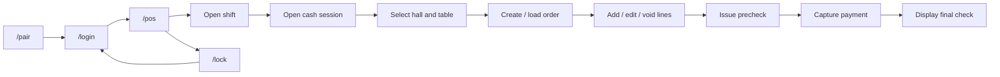

# Спецификация POS UI

## Назначение

Этот документ описывает **текущий и целевой UI surface** пакета `pos-ui`.

Он не описывает backend domain logic.
Он не подменяет backend API spec.
Он не подменяет RBAC matrix.

## Текущее состояние

`pos-ui` на текущем этапе - это cashier-first UI для одного all-in-one pilot terminal.

Реально поддерживаемые маршруты:

- `/pair`
- `/login`
- `/pos`
- `/lock`

Route `/` используется только как redirect entrypoint.

## Архитектурная позиция

Frontend не является source of truth.

Frontend:

- показывает состояние;
- отправляет команды в backend;
- не принимает финансовых решений;
- не рассчитывает право на операцию;
- не считает order/precheck/check totals;
- не определяет самостоятельно, можно ли закрыть заказ, отменить пречек или завершить оплату.

Все бизнес-решения принимает Edge backend.

## Identity model

UI использует два идентификатора устройства:

- `node_device_id` - identity Edge backend / Edge node;
- `client_device_id` - identity конкретного UI-клиента.

Правила:

- `node_device_id` не генерируется frontend;
- `node_device_id` приходит через pairing;
- `client_device_id` генерируется frontend через `crypto.randomUUID()` и хранится локально;
- все operator commands должны нести session/device/actor metadata.

## Экраны

### Pair

Назначение:

- первичное связывание UI-клиента с Edge node.

Действия:

- ввод pairing code;
- вызов `POST /api/v1/system/pair`;
- переход на `/login` после успешного pairing.

### Login

Назначение:

- вход сотрудника по PIN.

Действия:

- ввод PIN;
- вызов `POST /api/v1/auth/pin-login`;
- получение session + actor context + permissions;
- переход на `/pos`.

### POS

Назначение:

- основной cashier terminal flow.

Поддерживаемые блоки:

- текущий оператор и session status;
- pairing/session status strip;
- open/close shift;
- open/close cash session;
- halls list;
- tables list;
- active order by selected table;
- order creation;
- add line;
- change quantity;
- void line;
- issue precheck;
- cancel precheck через manager override dialog;
- cash payment;
- trusted manual card payment;
- final check display.

### Lock

Назначение:

- завершение локальной рабочей сессии.

Действия:

- backend logout;
- очистка локального session state;
- переход к `/login`.

## Реализованный пользовательский поток

## Server-state и local-state

### Server state

Через query-layer загружаются:

- pairing status;
- auth session;
- current shift;
- current cash session;
- halls;
- tables;
- current order by table;
- order by id;
- prechecks by order;
- menu items;
- final check.

### Локальное состояние

Локально разрешено хранить только:

- `client_device_id`;
- `node_device_id`;
- `restaurant_id`;
- `session_id`;
- actor context;
- purely visual UI state.

Запрещено хранить:

- PIN;
- manager PIN;
- финансовые итоги как source of truth;
- решающее право на операцию.

## Обязательные transport headers

Для operator/business flows UI обязан передавать:

- `X-Client-Device-ID`
- `X-Node-Device-ID`
- `X-Session-ID`
- `X-Actor-Employee-ID`

## Поддерживаемый pilot scope

Для первого пилота supported:

- cashier flow на одном all-in-one terminal;
- pairing -> login -> pos -> lock/logout;
- один локальный Edge backend;
- один локальный SQLite source of truth;
- наличная оплата;
- trusted manual card capture;
- manager override только для отмены пречека.

## Explicitly unsupported now

На текущем этапе **не считаются implemented now**:

- waiter mode runtime;
- KDS runtime;
- manager runtime;
- diagnostics runtime;
- settings runtime;
- reprint flow;
- refund flow;
- PSP integration;
- hardware printer integration from UI;
- multi-currency exponent handling beyond pilot assumptions;
- offline write queue in frontend.

## Документационные правила для UI

Если меняется хотя бы один из пунктов ниже, этот документ обновляется в том же PR:

- routes;
- visible screens;
- supported cashier actions;
- identity/session flow;
- supported/unsupported scope;
- manager override UI;
- transport headers used by UI.

Будущие режимы (`waiter`, `kds`, `manager`, `diagnostics`, `settings`) добавляются в этот документ только после появления router entrypoint, page shell и backend contract.
